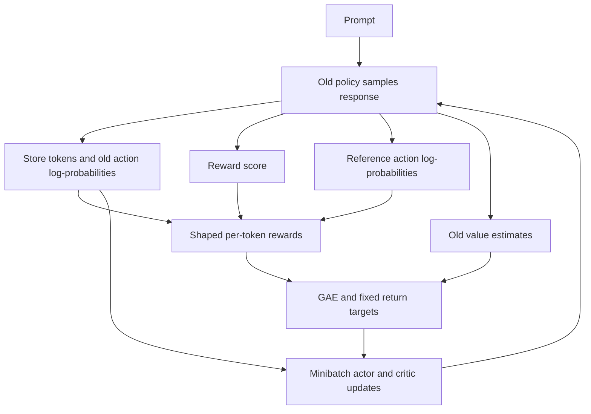
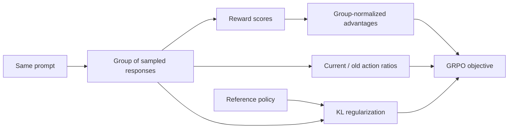

# RL

These notes cover reinforcement-learning foundations, language-model policy optimization, and a proposed shared-network experiment. Reviewed on 2026-09-30. Equations use discrete states/actions for readability; integrals replace sums in continuous settings.

## Contents

- [[#Markov Decision Process (MDP)]]
- [[#Bellman Equation]]
- [[#Dynamic Programming Iterations in RL]]
- [[#Monte Carlo Methods in RL]]
- [[#Temporal Difference]]
- [[#Policy Gradient]]
- [[#Actor-Critic]]
- [[#RL for LLM]]
- [[#GRPO]]
- [[#MoE]]
- [[#Multi-token training]]

## Markov Decision Process (MDP)

At time $t$, the agent observes state $S_t$, chooses action $A_t$, and receives reward $R_{t+1}$ and next state $S_{t+1}$.

| Symbol | Meaning |
|---|---|
| $\mathcal S$ | State space; $s$ is one state, not the entire set |
| $\mathcal A(s)$ | Actions available at state $s$ |
| $p(s',r\mid s,a)$ | Joint distribution of next state and reward |
| $\pi(a\mid s)$ | Stochastic policy; a deterministic policy chooses one action |
| $\rho_0$ | Initial-state distribution |
| $\gamma$ | Discount factor |

A state must contain enough information for the Markov assumption:

$$
p(S_{t+1},R_{t+1}\mid S_0,A_0,\ldots,S_t,A_t)
=p(S_{t+1},R_{t+1}\mid S_t,A_t).
$$

The separate transition and reward probabilities are marginals of this joint distribution; they need not be independent. A partial observation is not necessarily a Markov state.

A finite episode has $T$ actions and trajectory $(S_0,A_0,R_1,\ldots,S_{T-1},A_{T-1},R_T,S_T)$. Its return from time $t$ is

$$
G_t=\sum_{k=0}^{T-t-1}\gamma^kR_{t+k+1}.
$$

For continuing tasks, the sum may be infinite. Bounded rewards and $0\le\gamma<1$ ensure a finite discounted return. Undiscounted episodic problems need suitable termination/integrability assumptions.

## Bellman Equation

Values are expectations **conditioned on the starting state/action and subsequent policy**:

$$
V^\pi(s)=\mathbb E_\pi[G_t\mid S_t=s],\qquad
Q^\pi(s,a)=\mathbb E_\pi[G_t\mid S_t=s,A_t=a].
$$

The expectation equations are

$$
V^\pi(s)=\sum_a\pi(a\mid s)Q^\pi(s,a)
=\sum_a\pi(a\mid s)\sum_{s',r}p(s',r\mid s,a)[r+\gamma V^\pi(s')],
$$

$$
Q^\pi(s,a)=\sum_{s',r}p(s',r\mid s,a)
\left[r+\gamma\sum_{a'}\pi(a'\mid s')Q^\pi(s',a')\right].
$$

Set terminal-state values to zero. The optimality equations replace the next-action policy average with a maximum:

$$
V^*(s)=\max_a\sum_{s',r}p(s',r\mid s,a)[r+\gamma V^*(s')],
$$

$$
Q^*(s,a)=\sum_{s',r}p(s',r\mid s,a)[r+\gamma\max_{a'}Q^*(s',a')].
$$

## Dynamic Programming Iterations in RL

Dynamic programming uses the transition/reward model. For a finite discounted MDP, the Bellman operators are contractions; this supports the usual convergence statements below.

### Value iteration

Starting from a bounded $V_0$, repeatedly apply

$$
V_{k+1}(s)=\max_a\sum_{s',r}p(s',r\mid s,a)[r+\gamma V_k(s')].
$$

The maximizer defines a greedy policy. A separate stored Q-table is optional: the action lookahead can be computed from $V_k$ and the model.

### Policy iteration

1. **Evaluate a fixed policy:** solve $V^\pi=r_\pi+\gamma P_\pi V^\pi$. In finite problems this can be a linear solve, $(I-\gamma P_\pi)V^\pi=r_\pi$, or iterative updates to a chosen tolerance.
2. **Improve:** choose an action maximizing $\sum_{s',r}p(s',r\mid s,a)[r+\gamma V^\pi(s')]$ in each state.
3. Repeat until the policy is stable, using consistent tie-breaking.

Theoretical convergence of evaluation does not require a computer to execute literally infinitely many steps. Practical stopping tolerances give approximate evaluation.

### Truncated / modified policy iteration

Use a finite number of evaluation sweeps between greedy improvements. With the corresponding greedy-then-one-backup convention, one sweep yields value iteration; exact evaluation yields policy iteration. The ordering and initialization must match when making this equivalence.

## Monte Carlo Methods in RL

Monte Carlo (MC) estimates values from completed returns without a transition model. The original “MC Basic uses only the initial state” is a possible deliberately inefficient estimator, not a general definition of MC.

| Choice | Meaning |
|---|---|
| First-visit MC | Update from the first occurrence of each state or state-action pair in an episode |
| Every-visit MC | Update from every occurrence |
| Exploring starts | Give each relevant starting state-action pair nonzero probability |
| Epsilon-soft control | Maintain action exploration while improving a policy |

First-visit does **not** mean only the episode's initial step. Exploring starts is an exploration assumption, independent of first/every-visit estimation; it does not imply every-visit MC.

For sample averaging at the $n$th visit:

$$
Q(s,a)\leftarrow Q(s,a)+\frac1n[G_t-Q(s,a)].
$$

Constant-step updates also exist. Setting the step size to one overwrites the estimate with the latest return; it is not the defining MC rule.

For a finite action set with one chosen greedy action $a^*$:

$$
\pi(a\mid s)=\frac{\epsilon}{|\mathcal A(s)|}+(1-\epsilon)\mathbf1[a=a^*].
$$

Exploration cannot reach unreachable states. Coverage and convergence require assumptions about reachability, visitation, step sizes, and policy updates. A fixed positive $\epsilon$ maintains exploration but does not converge to a fully greedy policy; GLIE schedules aim for infinite exploration while becoming greedy in the limit.

<a id="0DFD0B33-8109-4740-926E-75DA2CB5334C"></a>

## Temporal Difference

TD prediction learns a **value function**, not directly a policy. It bootstraps from a current estimate:

$$
\delta_t=R_{t+1}+\gamma V(S_{t+1})-V(S_t),\qquad
V(S_t)\leftarrow V(S_t)+\alpha_t\delta_t.
$$

This is stochastic approximation to the Bellman fixed point. Define the residual $(T_\pi V)(s)-V(s)$ with the expectation conditioned on $S_t=s$ and actions following $\pi$. Convergence is not guaranteed for an arbitrary root-finding problem just because an update has a plus sign: the expected update must be stable and sampling/step-size assumptions must hold.

Common tabular conditions include adequate visitation and per-state step sizes satisfying $\sum_t\alpha_t=\infty$, $\sum_t\alpha_t^2<\infty$. A reward sample can itself be noisy; TD targets are not always less noisy or more accurate on each individual update than the existing estimate.

### Unified action-value update

$$
Q(S_t,A_t)\leftarrow Q(S_t,A_t)+\alpha_t[y_t-Q(S_t,A_t)].
$$

| Algorithm | Target $y_t$ | Qualification |
|---|---|---|
| Sarsa | $R_{t+1}+\gamma Q(S_{t+1},A_{t+1})$ | On-policy when the next action follows the behavior/target policy |
| Q-learning | $R_{t+1}+\gamma\max_aQ(S_{t+1},a)$ | Off-policy optimality backup |
| Expected Sarsa | $R_{t+1}+\gamma\sum_a\pi(a\mid S_{t+1})Q(S_{t+1},a)$ | Can be on- or off-policy, depending on the policy used in the expectation |
| $n$-step Sarsa | $\sum_{k=0}^{n-1}\gamma^kR_{t+k+1}+\gamma^nQ(S_{t+n},A_{t+n})$ | Truncate at termination and omit terminal bootstrap |
| Monte Carlo | $G_t$ | No bootstrap; wait for the completed return |

Expected Sarsa removes next-action sampling variance conditional on the next state; it does not remove transition/reward uncertainty. These updates resemble regression against a target, but bootstrapped function-approximation updates are generally **semi-gradients**, not full gradients of the mean squared Bellman residual.

### Deep Q-learning

DQN replaces a table with $Q_w(s,a)$. For a replay-buffer sample, using a separate target network $w^-$:

$$
y=R+\gamma(1-d)\max_{a'}Q_{w^-}(S',a'),\qquad
L(w)=\mathbb E[(Q_w(S,A)-\operatorname{stopgrad}(y))^2].
$$

Here $d=1$ means true termination. A time-limit truncation is not automatically terminal; bootstrap from its actual final observation when appropriate.

Sample minibatches from replay, update the online network, and periodically copy online weights to the target network. Huber loss is also commonly used. Replay and target networks improve stability; they do not establish general convergence to $Q^*$ with nonlinear approximation. See the [DQN paper](https://www.nature.com/articles/nature14236).

<a id="4711B696-A708-4093-A33A-5CEF4EDA902C"></a>

## Policy Gradient

### Discounted and average-reward objectives

For a fixed starting distribution $\rho_0$:

$$
J(\theta)=\mathbb E_{S_0\sim\rho_0}[V^{\pi_\theta}(S_0)]
=\mathbb E_{\pi_\theta}\left[\sum_{t\ge0}\gamma^tR_{t+1}\right].
$$

This is a starting-distribution-weighted discounted value, not necessarily a stationary average reward. Under suitable ergodicity assumptions, the separate average-reward objective is

$$
\bar r_\pi=\sum_s d_\pi(s)r_\pi(s)
=\lim_{T\to\infty}\frac1T\mathbb E_\pi\left[\sum_{t=0}^{T-1}R_{t+1}\right].
$$

Average-reward policy-gradient results use differential value functions and should not silently substitute discounted $Q^\pi$.

### Occupancy measure and exact gradient

Let the **unnormalized** discounted occupancy be

$$
\eta_\pi(s)=\sum_{t\ge0}\gamma^t\Pr_\pi(S_t=s\mid S_0\sim\rho_0).
$$

Then

$$
\nabla_\theta J=\sum_s\eta_\pi(s)\sum_a\nabla_\theta\pi_\theta(a\mid s)Q^\pi(s,a).
$$

For $d_\pi^\gamma=(1-\gamma)\eta_\pi$ and $\gamma<1$:

$$
\nabla_\theta J=\frac1{1-\gamma}\mathbb E_{S\sim d_\pi^\gamma,A\sim\pi}
[\nabla_\theta\log\pi_\theta(A\mid S)Q^\pi(S,A)].
$$

The policy-gradient theorem accounts for occupancy dependence; it does not become approximate merely because an explicit $\nabla d_\pi$ term disappears. The constant changes if a normalized objective is used. Sampling states with another weighting can change the objective/estimator.

### REINFORCE and the log-derivative trick

For $\pi_\theta(a\mid s)>0$,

$$
\nabla\log\pi_\theta(a\mid s)=\frac{\nabla\pi_\theta(a\mid s)}{\pi_\theta(a\mid s)}.
$$

A complete-episode estimator for the discounted starting-state objective is

$$
\hat g=\sum_{t=0}^{T-1}\gamma^t\nabla_\theta\log\pi_\theta(A_t\mid S_t)[G_t-b(S_t)],
\qquad \theta\leftarrow\theta+\alpha\hat g.
$$

Compute all terms at the rollout policy parameters before the update. A state-only baseline leaves the expected score-function gradient unchanged; suitable baselines can reduce variance, but an arbitrary baseline need not do so. Treat the baseline/advantage as fixed in the actor update.

Positive advantage locally encourages a sampled action; negative advantage discourages it. This is not a guarantee about finite steps, overall reward improvement, or probabilities at other states under shared parameters.

<a id="AC79E6FC-992B-47AE-B277-665899FAD593"></a>

## Actor-Critic

The **actor** is the policy; the **critic** estimates value. A Q-critic may use a Sarsa-style semi-gradient update:

$$
\delta_t^Q=R_{t+1}+\gamma Q_w(S_{t+1},A_{t+1})-Q_w(S_t,A_t),
\qquad w\leftarrow w+\alpha_w\delta_t^Q\nabla_wQ_w(S_t,A_t).
$$

For a state-value critic, define

$$
A^\pi(s,a)=Q^\pi(s,a)-V^\pi(s),\qquad
\delta_t=R_{t+1}+\gamma V_w(S_{t+1})-V_w(S_t).
$$

$\delta_t$ is a **sample advantage estimate**, not the definition of advantage. With the true $V^\pi$, its conditional expectation given $(s,a)$ equals $A^\pi(s,a)$. An approximate critic introduces estimation error.

A basic actor update is proportional to $\delta_t\nabla_\theta\log\pi_\theta(A_t\mid S_t)$, while the critic uses $w\leftarrow w+\alpha_w\delta_t\nabla_wV_w(S_t)$. Include the discounted time/occupancy weighting required by the chosen objective. Terminal bootstraps are zero.

### Off-policy actor-critic

For behavior policy $\mu$, the action ratio $\rho_t=\pi_\theta(A_t\mid S_t)/\mu(A_t\mid S_t)$ can correct the **conditional action distribution** if behavior covers target-policy support. It does not by itself correct a mismatch between behavior and target **state distributions**. An unbiased target-objective gradient may require trajectory/state-distribution corrections or a different objective; off-policy critic learning also needs a suitable algorithm.

### Shared or separate networks

Actor and critic can share a backbone or use separate networks. Shared parameters can cause gradient interference, but catastrophic forgetting is not inevitable. Separate models cost more memory; shared models can still use different head learning rates, loss weights, or alternating updates. [Phasic Policy Gradient](https://arxiv.org/abs/2009.04416) is one approach to separating phases of policy and value training, not a proof that sharing always fails.

<a id="7D209C6C-FBAD-41BA-846C-FD8EBA22EE1A"></a>

## RL for LLM

### Tokens as actions

For prompt $x$ and response tokens $y_0,\ldots,y_{T-1}$, state $s_t=(x,y_{<t})$, action $a_t=y_t$, and the next state appends that token. Termination may be EOS; an imposed generation limit needs an explicit terminal/truncation convention.

With environment dynamics independent of $\theta$:

$$
P_\theta(\tau)=\rho_0(s_0)\prod_{t=0}^{T-1}\pi_\theta(a_t\mid s_t)p(s_{t+1}\mid s_t,a_t),
$$

$$
\nabla_\theta\log P_\theta(\tau)=\sum_{t=0}^{T-1}\nabla_\theta\log\pi_\theta(a_t\mid s_t).
$$

Thus $\nabla_\theta\mathbb E[R(\tau)]=\mathbb E[R(\tau)\nabla_\theta\log P_\theta(\tau)]$ for a parameter-independent trajectory reward. If a reward term explicitly depends on $\theta$, its derivative needs separate treatment. For finite language-model responses, $\gamma=1$ is a common convention, not a universal rule.

### GAE and return targets

For $n$ steps before termination, with terminal $V=0$:

$$
\hat A_t^{(n)}=\sum_{k=0}^{n-1}\gamma^k r_{t+k+1}+\gamma^nV_{\rm old}(s_{t+n})-V_{\rm old}(s_t)
=\sum_{k=0}^{n-1}\gamma^k\delta_{t+k}.
$$

The intermediate terms are **rewards**, not a sum of successive value estimates. For a rollout of length $T$:

$$
\hat A_t^{\rm GAE}=\sum_{l=0}^{T-t-1}(\gamma\lambda)^l\delta_{t+l},
\qquad \hat G_t=\hat A_t^{\rm GAE}+V_{\rm old}(s_t).
$$

Use the appropriate final bootstrap at a truncation. The infinite weighted-$n$-step expression uses weights $(1-\lambda)\lambda^{n-1}$; a finite mixture needs the final residual weight, not simply a truncated geometric series. See [GAE](https://arxiv.org/html/1506.02438v6).

Critic regression uses a frozen target:

$$
L_V(\psi)=\mathbb E_t[(V_\psi(s_t)-\operatorname{stopgrad}(\hat G_t))^2].
$$

Using the same differentiable $V_\psi$ on both sides of $V_\psi-(A+V_\psi)$ cancels the prediction and is not the intended critic loss.

### VPG, TRPO, and PPO

VPG maximizes a sampled log-probability objective weighted by fixed advantages. TRPO instead optimizes a local importance-ratio surrogate with an average KL constraint:

$$
\max_\theta\;\mathbb E_{t\sim\pi_{\rm old}}[\rho_t(\theta)\hat A_t],
\quad \mathbb E_t[D_{KL}(\pi_{\rm old}(\cdot\mid s_t)\|\pi_\theta(\cdot\mid s_t))]\le\delta,
$$

where $\rho_t=\pi_\theta(a_t\mid s_t)/\pi_{\rm old}(a_t\mid s_t)$. Practical TRPO approximates its theoretical trust-region update; arbitrary reuse of old data is not justified by this action ratio alone. See [TRPO](https://arxiv.org/abs/1502.05477).

PPO's clipped policy objective is

$$
L^{\rm CLIP}=\mathbb E_t[\min(\rho_t\hat A_t,\operatorname{clip}(\rho_t,1-\epsilon,1+\epsilon)\hat A_t)].
$$

Minimize $-L^{\rm CLIP}$ plus weighted critic loss and, optionally, a negative entropy bonus. Clipping limits the surrogate incentive; it is **not** a hard bound on policy ratios or a guarantee of monotonic improvement. $\epsilon$ is a tuned hyperparameter. PPO is a widely used method, not the sole standard for LLM alignment. See [PPO](https://arxiv.org/abs/1707.06347).

### A PPO rollout and update

Keep these models/concepts distinct:

| Component | Role |
|---|---|
| Current actor | Policy being optimized |
| Old policy | Policy that generated this rollout; store its token log-probabilities |
| Reference policy | Usually a fixed anchor for regularization, distinct from old policy |
| Reward source | Learned reward model, verifier, or rule-based score |
| Critic | Expected future shaped return from each prefix, not simply the next token's reward |

For sampled action log-probabilities $\ell_t^{\rm old}$ and $\ell_t^{\rm ref}$, one rollout shaping convention is

$$
\tilde r_{t+1}=r_{t+1}-\beta(\ell_t^{\rm old}-\ell_t^{\rm ref}).
$$

The sampled log-ratio can be negative; its expectation over old-policy actions is $D_{KL}(\pi_{\rm old}\|\pi_{\rm ref})$ at that state. A scalar outcome score goes at the last valid response token, not at every token.



Collect with no gradients, compute/store fixed advantages and return targets, then recompute current policy log-probabilities and values for each minibatch update. Keep old log-probabilities fixed across PPO epochs. Clear gradients before each update. Detach the reference, advantages, and targets. The old missing PNG illustration is replaced by the diagram above.

### PyTorch loss utilities

These functions implement the numerical pieces, **not a complete trainer**. They assume finite tensors, no episode reset inside a row, and right-padded response masks with at least one valid token per sequence. `bootstrap` is zero at a true terminal and may be nonzero at a truncation. No values or logits may read future response tokens through the model's causal mask.

```python
import torch
import torch.nn.functional as F


def action_log_probs(logits, token_ids):
    # Full prompt+response: logits at position j predict token j+1.
    # Output: [batch, sequence_length - 1], before response masking.
    return F.log_softmax(logits[:, :-1].float(), dim=-1).gather(
        -1, token_ids[:, 1:].unsqueeze(-1)
    ).squeeze(-1)


@torch.no_grad()
def gae_returns(rewards, old_values, mask, bootstrap, gamma=1.0, lam=0.95):
    # rewards/old_values/mask: [B, T], response positions only.
    mask = mask.bool()
    if not mask.any(dim=1).all():
        raise ValueError("Each response must contain at least one valid token")
    if (mask[:, 1:] & ~mask[:, :-1]).any():
        raise ValueError("Expected right padding with no gaps")
    advantages = torch.zeros_like(rewards)
    running = torch.zeros_like(bootstrap)
    next_value = bootstrap.clone()
    for t in range(rewards.shape[1] - 1, -1, -1):
        valid = mask[:, t]
        delta = rewards[:, t] + gamma * next_value - old_values[:, t]
        candidate = delta + gamma * lam * running
        running = torch.where(valid, candidate, running)
        advantages[:, t] = torch.where(valid, running, 0.0)
        next_value = torch.where(valid, old_values[:, t], next_value)
    returns = torch.where(mask, advantages + old_values, 0.0)
    return advantages, returns


def ppo_loss(new_logps, old_logps, advantages, new_values, returns,
             mask, clip_eps=0.2, value_weight=0.5):
    # All inputs [B, T], aligned to sampled response actions.
    mask = mask.bool()
    if not mask.any():
        raise ValueError("No valid response tokens")
    # Select before exponentiation: padded logps do not enter the loss.
    ratio = (new_logps[mask] - old_logps.detach()[mask]).exp()
    adv = advantages.detach()[mask]
    actor = -torch.minimum(
        ratio * adv, ratio.clamp(1 - clip_eps, 1 + clip_eps) * adv
    ).mean()
    critic = (new_values[mask] - returns.detach()[mask]).square().mean()
    return actor + value_weight * critic, actor, critic
```

Align the response mask to the **shifted** next-token targets. `log_softmax` alone still has shape `[B,L,V]`; `gather` selects the sampled action and removes the vocabulary dimension. Keep EOS as a valid token when it belongs to the response. This example averages valid tokens globally, so longer responses have more weight; per-response averaging is a different choice.

## GRPO

For $G$ responses to the **same prompt**, with scalar scores $R_i$:

$$
\bar R=\frac1G\sum_iR_i,\qquad
\hat A_i=\frac{R_i-\bar R}{\sigma_R+\varepsilon_{\rm num}}.
$$

It is each individual reward minus the mean, not the sum of rewards minus the mean. Specify the standard-deviation convention and handle zero variance. An all-equal-score group provides no relative reward signal.

The original outcome-supervised GRPO objective includes response-length averaging:

$$
J=\mathbb E\left[\frac1G\sum_{i=1}^G\frac1{|o_i|}\sum_t
\left\{\min(\rho_{i,t}\hat A_i,\operatorname{clip}(\rho_{i,t},1-\epsilon,1+\epsilon)\hat A_i)
-\beta D_{KL}\right\}\right].
$$

GRPO removes the learned value critic, not the need for rewards. Rewards may be rules or learned scores. In the original formulation, reference KL is a separate regularizer, not automatically folded into group normalization. Removing a critic saves its cost but adds group sampling and does not eliminate all optimization difficulties. See [DeepSeekMath](https://arxiv.org/html/2402.03300v3).



## MoE

Mixture-of-experts routing selects expert subnetworks. Shared experts can process every token; describing them as guaranteed “common-sense experts” assigns a meaning not established by the architecture.

For Switch-style top-1 routing, a balancing loss is

$$
L_{\rm aux}=\alpha N\sum_{i=1}^N f_iP_i,
$$

where $f_i$ is the fraction of tokens assigned to expert $i$ and $P_i$ is its average router probability. This encourages balanced usage; it does not guarantee identical specialization or equal realized load. See [Switch Transformers](https://arxiv.org/abs/2101.03961).

DeepSeek-V3's auxiliary-loss-free balancing adjusts a per-expert bias used for **selection**: overloaded experts receive lower bias, underloaded experts higher bias. The bias is not simply a universal “before softmax” modification; its unmodified affinity scores determine the selected experts' mixture weights. The report also describes a separate sequence-wise balancing term. See [DeepSeek-V3](https://arxiv.org/html/2412.19437v2).

## Multi-token training

### MTP versus speculative decoding

**Multi-token prediction (MTP)** trains extra future-token predictions. **Speculative decoding** proposes tokens and verifies them with a target model; a smaller draft model is one way to produce proposals. These are distinct ideas, although MTP heads can support speculative decoding. Correct rejection/correction sampling, not simply “accept if plausible,” is needed to preserve a target sampling distribution. Sources: [MTP](https://arxiv.org/abs/2404.19737), [speculative decoding](https://arxiv.org/abs/2211.17192).

### Research proposal: shared backbone, value head, and MTP loss

The original “MTP as an implicit critic” discussion is an **unvalidated design proposal**, not a published algorithm established by these notes. Adding a scalar value head still introduces a critic, even when there is no separate critic backbone. MTP token prediction alone is not value learning.

A coherent baseline design defines $V_\psi(s_t)$ as the value of the **current** prefix. With a target estimate $V_{\bar\psi}$:

$$
y_t=r_{t+1}+\gamma(1-d_t)V_{\bar\psi}(s_{t+1}),\qquad
\hat A_t=\operatorname{stopgrad}(y_t-V_\psi(s_t)),
$$

$$
L_{\rm actor}=-\hat A_t\log\pi_\theta(a_t\mid s_t),\qquad
L_V=(V_\psi(s_t)-\operatorname{stopgrad}(y_t))^2,
$$

$$
L=L_{\rm actor}+c_VL_V+c_{\rm MTP}L_{\rm MTP}+c_{\rm LM}L_{\rm LM}.
$$

The direct actor expression assumes appropriately sampled fresh data; repeated updates need a justified off-policy or PPO-style treatment. The token losses require explicit supervised targets. Omitting the actor term does not, by itself, implement policy-gradient reward optimization.

```text
prefix s_t -> shared backbone -> policy head -> action a_t
                            -> value head  -> V(s_t)
                            -> MTP heads   -> future-token predictions
next prefix s_(t+1) -> value estimate -> detached TD target for V(s_t)
```

If a lookahead head instead claims to predict $V(s_{t+k})$, specify whether it conditions on sampled future tokens or marginalizes over them. It cannot know a realized future prefix before those actions occur. The old equations shifted the value indexing inconsistently by one step.

### Stability and evaluation

An exponential moving average, $\bar\psi\leftarrow\tau\psi+(1-\tau)\bar\psi$, differs from periodic hard copying. Copying only the value/MTP head does not freeze its target function if the shared backbone keeps changing. A small output layer is cheap, but a complete MTP module may contain substantial transformer computation; its size is architecture-dependent.

This proposal may save memory relative to two full backbones, but savings and learning quality require measurement. Bootstrapping does not reveal exactly which token caused a reward, and MTP does not guarantee better planning or lower variance. There is no established “golden” loss ratio or general justification for fixing the value coefficient to `0.1`.

Compare against a standard shared-backbone actor-critic and suitable PPO/GRPO baselines. Measure reward, held-out language quality, value calibration, memory, and throughput. Ablate MTP loss, target-update strategy, and loss weights before claiming a benefit.

## Review notes

The mathematical corrections above preserve the original learning topics while removing repeated PPO pseudocode, invalid placeholders, and references to missing images. The numerical functions are educational building blocks, not evidence of a trained model or convergence on a real task.
