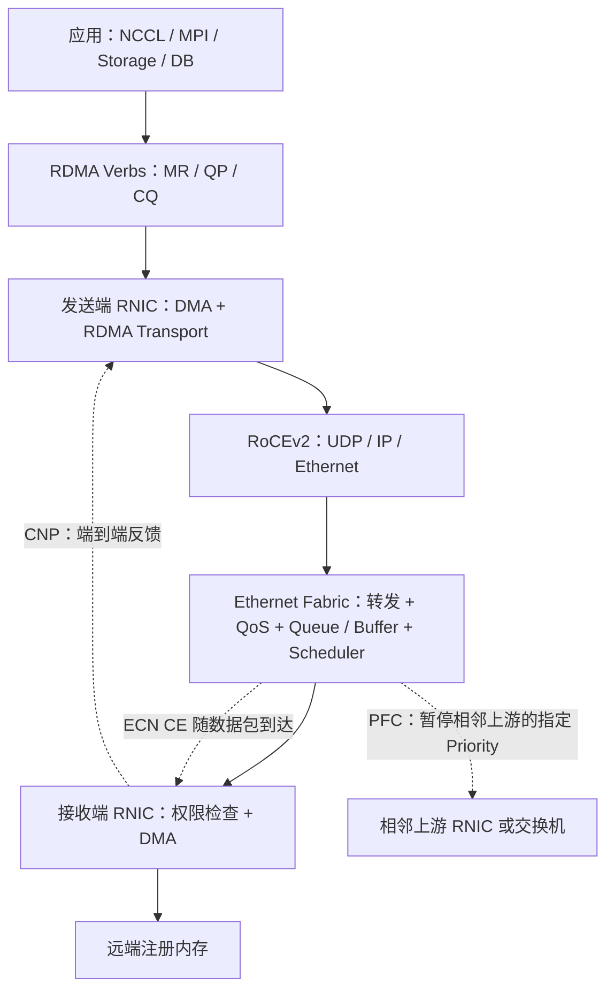
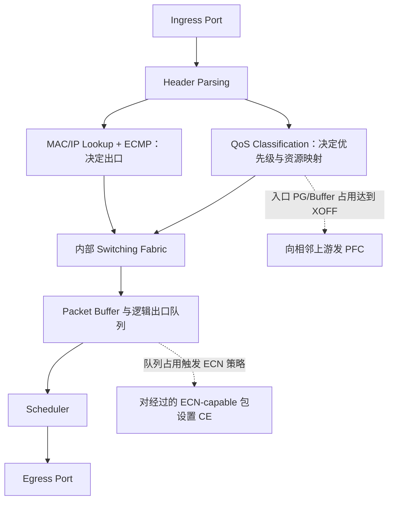
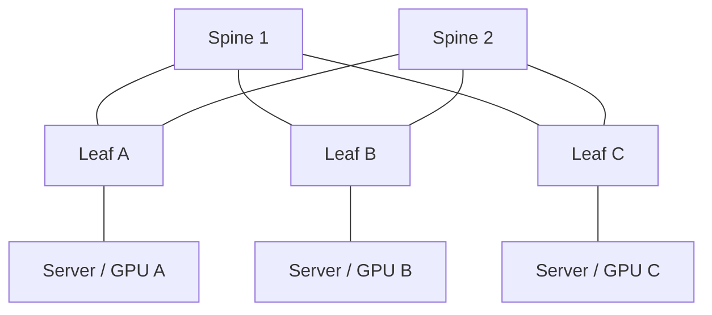
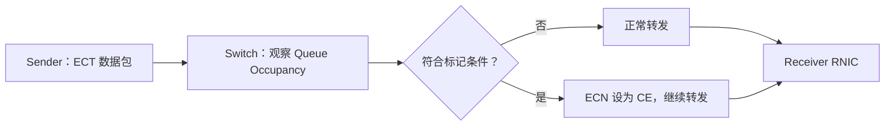
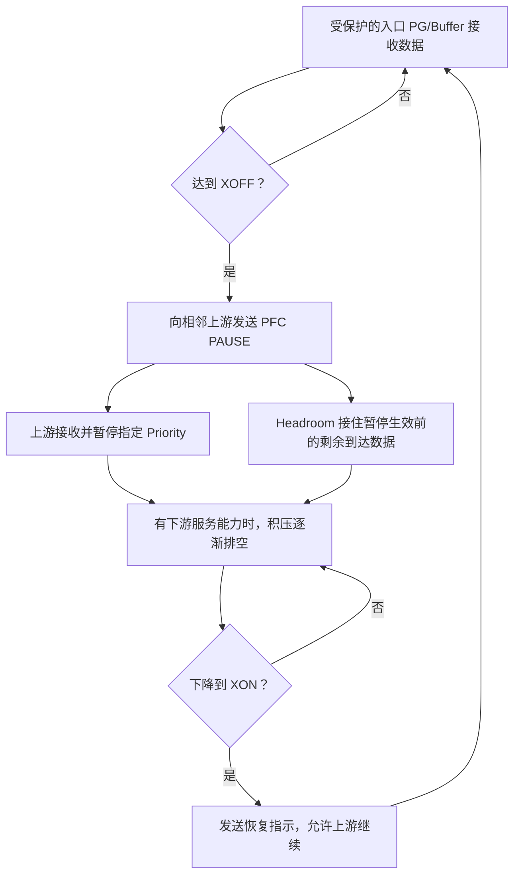
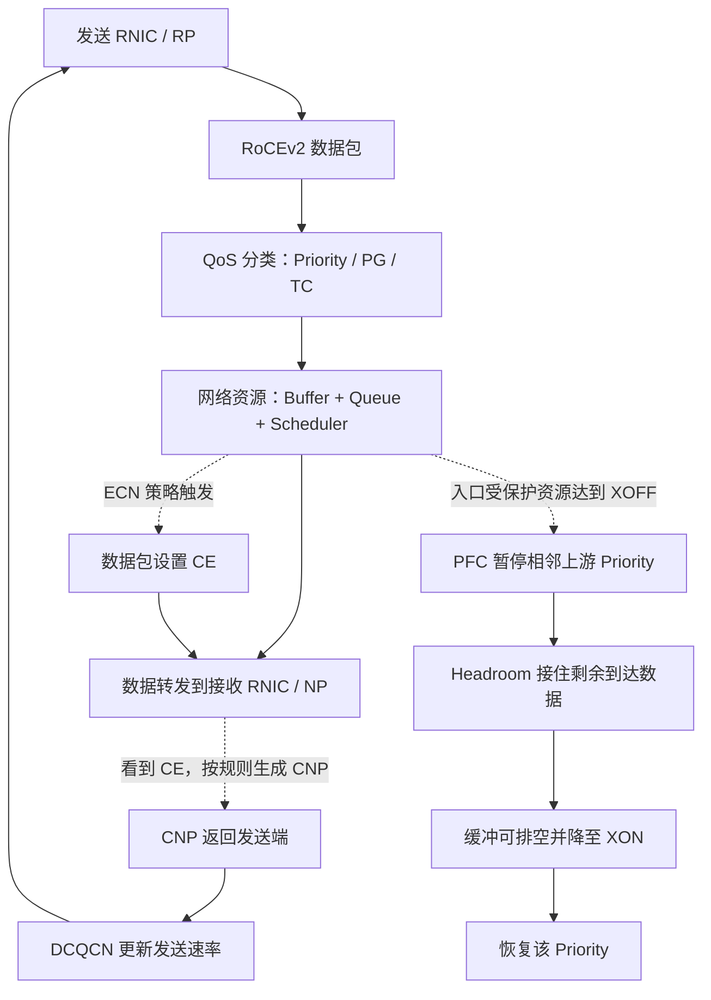
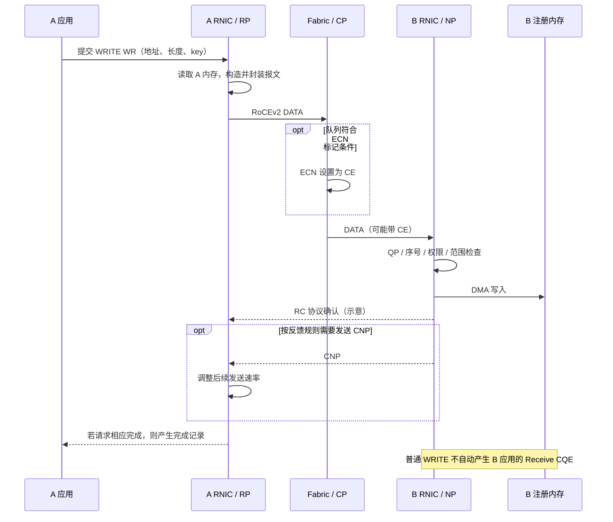

# RoCE 与 RDMA：从远程内存操作到 Ethernet Fabric 的完整知识体系

本文整合 [RoCE.md](./RoCE.md)、[Switch.md](./Switch.md) 和 [PFC+DCQCN.md](./PFC+DCQCN.md)，按“应用与端点 → 协议封装 → 交换机与网络 → 拥塞控制 → 完整操作与排障”重新组织。重复概念合并解释，原文的独立知识点、关键流程和数值示例保留；必要的背景与精确性补充直接放入相关章节。文末提供原文章节覆盖索引。

**主线：RoCE 将 RDMA 的通信与内存访问语义运行在 Ethernet 上；RoCEv2 通过 UDP/IP 接入可路由的数据中心网络。RNIC 负责 RDMA 状态、内存访问和传输控制，交换机负责转发、排队和拥塞信号，两者通过 ECN → CNP → 端点调速形成反馈闭环。PFC 则提供可选的逐跳缓冲保护。**

本文的数据路径主要以 **RoCEv2 + RC（Reliable Connected）+ 硬件 RNIC** 为例。其他 QP 类型、设备架构或固件可能具有不同语义。文中的队列编号、速率和百分比用于解释机制，不代表通用配置模板。

## 阅读导航

1. [整体架构与技术边界](#overview)
2. [RDMA 编程模型、内存与完成语义](#rdma)
3. [InfiniBand、RoCEv1、RoCEv2 与 iWARP](#transports)
4. [RoCEv2 封装、可靠性与 ECMP 熵](#encapsulation)
5. [交换机内部的数据包生命周期](#switch)
6. [QoS、Priority、Traffic Class 与 Queue](#qos)
7. [Buffer、Shared Buffer、HOL 与 VOQ](#buffers)
8. [Scheduler 与带宽分配](#scheduling)
9. [Leaf-Spine、ECMP 与拥塞来源](#fabric)
10. [用速率、时间和容量理解拥塞](#queue-math)
11. [ECN → CNP → DCQCN 反馈闭环](#dcqcn)
12. [PFC、XOFF/XON、Headroom 与副作用](#pfc)
13. [ECN/DCQCN 与 PFC 如何协同](#coordination)
14. [一次 RDMA WRITE 的完整过程](#write-lifecycle)
15. [Lossless 与 Lossy RoCE 的设计选择](#deployment)
16. [AI/HPC、GPUDirect RDMA 与分层排障](#operations)
17. [概念辨析、术语速查与记忆模型](#reference)
18. [原文覆盖索引与补充资料](#sources)

<a id="overview"></a>

## 1. 整体架构与技术边界

### 1.1 先区分三个问题

| 层面 | 要解决的问题 | 主要机制 |
|---|---|---|
| RDMA 端点 | 应用如何读写远端内存？谁有权限？操作何时完成？ | Verbs、QP、MR、CQ、RNIC、DMA |
| 网络数据路径 | 数据包如何到达对端？在哪里等待？如何分享带宽？ | Ethernet/IP、Lookup、QoS、Buffer、Queue、Scheduler、Leaf-Spine、ECMP |
| 拥塞反馈与保护 | 网络来不及发送时，如何减少输入并避免缓冲溢出？ | ECN、CNP、DCQCN、PFC、Headroom |

这三个层面相互依赖，但职责不同：增大 Buffer 不会提高链路容量；PFC 不会完成 RDMA 内存访问；UDP 也不负责 RC 的可靠交付。

### 1.2 RoCE 的“复用 + 适配”思想

InfiniBand 已经提供了适用于 HPC 的 RDMA 通信模型、低延迟传输和硬件卸载，但部署时需要相应的 HCA、IB Switch、Fabric 和网络管理。与此同时，数据中心已有 Ethernet NIC、Ethernet Switch、IP Routing、VLAN、QoS、ECMP、监控与运维体系。

RoCE（**RDMA over Converged Ethernet**）将这两套技术连接起来：

- **复用 RDMA/InfiniBand：** Verbs、QP、MR、CQ、WR/WQE、READ/WRITE、SEND/RECEIVE、Atomic 和 IBTA Transport Semantics。
- **复用 Ethernet/IP：** 帧传输、MAC/IP 转发、VLAN、DSCP/PCP、QoS、队列与缓冲、调度、ECN、PFC、ECMP 和 Leaf-Spine。
- **完成适配：** 在 Ethernet 上承载 RDMA Transport；RoCEv2 加入 UDP/IP、UDP 目的端口 `4791`、源端口流标识，以及基于 ECN/CNP 的 RDMA 拥塞反馈。DCQCN 等控制器在端点执行调速。

应用可以继续使用既有 RDMA 软件模型。例如 `PyTorch → NCCL → RDMA`，或 `MPI → RDMA Verbs`。上层库可以屏蔽 IB/RoCE 差异，但设备选择、寻址、连接建立和网络参数仍须正确配置。

### 1.3 完整分层

| 层次 | 代表对象或机制 | 主要职责 |
|---|---|---|
| 应用 | MPI、NCCL、分布式存储、数据库 | 组织通信和计算 |
| API | `ibv_reg_mr()`、`ibv_create_qp()`、`ibv_post_send()`、`ibv_post_recv()`、`ibv_poll_cq()` | 管理资源、提交操作、获取完成状态 |
| RDMA 对象 | PD、MR、QP、CQ、WQE | 维护权限、队列和通信上下文 |
| RDMA Transport | 以 RC 为例的序号、确认、重试、顺序和操作语义 | 在两个端点间执行 RDMA 操作 |
| RoCEv2 封装 | UDP，目的端口 `4791` | 将 RDMA Transport 接入 IP 网络，提供流哈希熵 |
| IP | IPv4/IPv6、DSCP、ECN、Routing | 路由、业务分类标记和拥塞标记 |
| Ethernet | MAC、可选 VLAN/PCP、可选 PFC | 链路传输与逐跳流控 |
| Fabric | Leaf-Spine、ECMP、ASIC、Queue、Buffer、Scheduler | 承载、转发和分配网络资源 |



<a id="rdma"></a>

## 2. RDMA 编程模型、内存与完成语义

### 2.1 RDMA 为什么能降低 CPU 开销

RDMA（**Remote Direct Memory Access，远程直接内存访问**）允许 RNIC 在已授权的内存之间传输数据。典型路径为：

```text
发送端应用内存 → 本地 DMA → 发送端 RNIC
             → 网络 → 接收端 RNIC → 本地 DMA → 接收端应用内存
```

传统 Socket 路径通常包含内核协议处理、内核缓冲和应用缓冲之间的数据搬运。硬件 RDMA 将大量传输处理和数据搬运卸载到 RNIC，降低逐包 CPU 工作、系统调用和额外复制。

这里有三个需要区分的概念：

- **Kernel Bypass：** 建立资源后，常用数据路径不必逐次经过内核网络协议栈；驱动、资源创建、权限管理和异常处理仍可能需要内核。
- **Zero Copy：** 尽量减少中间 CPU `memcpy()`；数据仍需经过 DMA、PCIe、内存控制器和网络，并非物理上不移动。
- **低 CPU Overhead：** 不等于零 CPU。应用组织通信、提交 WR、轮询 CQ、处理完成事件与同步仍有成本。

这些特点服务于共同目标：高吞吐、低延迟、较低 CPU 开销以及更可预测的性能。传统 TCP 也有卸载和零复制优化，因此这里比较的是典型工作路径，而非断言所有 TCP 实现都必须多次复制。

### 2.2 核心对象及其关系

| 对象 | 全称 | 含义与关系 |
|---|---|---|
| RNIC | RDMA-capable Network Interface Card | 执行 DMA、QP 状态管理、报文生成、传输协议、完成通知与拥塞反应 |
| PD | Protection Domain | 将 QP、MR 等资源放入一个保护域，约束资源之间的访问关系 |
| MR | Memory Region | 注册给 RNIC、带有地址范围和访问权限的内存区域 |
| `lkey` | Local Key | 本地 WR/SGE 引用 MR 时使用的访问标识 |
| `rkey` | Remote Key | 远程 RDMA 操作使用的内存访问标识，配合地址范围和权限检查 |
| QP | Queue Pair | 通信状态对象，通常包含 SQ 和 RQ |
| SQ / RQ | Send Queue / Receive Queue | SQ 接收发送、READ、WRITE 等工作；RQ 提供接收请求与接收资源 |
| WR | Work Request | 应用提交的操作描述，如操作码、地址、长度和 key |
| WQE | Work Queue Element | 提交给设备后在工作队列中的操作描述；具体格式由设备/provider 实现 |
| SGE | Scatter/Gather Element | 描述本地数据片段，通常包含地址、长度、`lkey` |
| CQ | Completion Queue | 存放操作完成记录，可关联一个或多个 QP 的工作队列 |
| CQE / WC | Completion Queue Entry / Work Completion | 硬件完成记录及应用通过 Verbs 获得的完成信息，包含成功或错误状态 |

```text
应用创建 PD
  ├─ 注册 MR → 获取 lkey / rkey
  └─ 创建 QP → SQ / RQ → 关联 CQ

应用提交 WR → provider/设备形成 WQE → RNIC 执行
                                      ↓
                           按完成规则产生 CQE
                                      ↓
                            应用轮询或等待事件
```

PD、key 与接收请求等补充定义可参阅 [NVIDIA RDMA Programming Guide](https://networking-docs.nvidia.com/doca/archive/3-5-0/rdma-aware-networks-programming-guide)。

### 2.3 Memory Registration 与访问权限

注册内存的基本形式为：

```c
ibv_reg_mr(pd, address, length, access_flags);
```

注册将内存范围、保护域、地址转换和允许的操作关联到 RNIC。传统注册通常固定内存页；支持 ODP（On-Demand Paging）的实现可以采用按需分页机制，因此不能把所有 MR 都理解为永久固定的物理页。

对普通 RDMA WRITE，发送端一般需要本地源缓冲及其 `lkey`，还需要接收端提供的远端地址、可写长度与 `rkey`。接收端 RNIC 检查 MR 是否有效、范围是否越界、key 是否匹配、是否允许远程写入。注册权限可分别控制本地写、远程读、远程写和远程原子操作。[libibverbs：ibv_reg_mr](https://man7.org/linux/man-pages/man3/ibv_reg_mr.3.html)

`rkey` 是访问控制标识，不是加密密钥，也不能代替可信的连接建立与应用授权。缓冲区在未完成的操作仍可能访问它时，不能随意释放、注销或重新用于无关数据。

### 2.4 READ、WRITE、SEND/RECEIVE 与 Atomic

下表以常见 RC 操作为背景：

| 操作 | 数据方向与目标 | 对端是否要预先提交 Receive WR | 对端应用通知 |
|---|---|---|---|
| RDMA WRITE | 本地内存 → 指定远端地址，由发起端提供地址与 `rkey` | 普通 WRITE 不需要 | 普通 WRITE 不自动产生远端 Receive CQE |
| RDMA READ | 指定远端内存 → 本地内存 | 不需要 | 普通 READ 不自动通知远端应用 |
| SEND / RECEIVE | SEND 的数据进入对端预先发布的接收缓冲；由接收端决定缓冲位置 | 需要 | 接收完成可产生 Receive CQE |
| WRITE WITH IMMEDIATE | 数据写入指定远端地址，同时携带 immediate 信息 | 需要接收请求，用于通知；数据仍写入指定 MR | 产生带 immediate 信息的接收完成 |
| Atomic | 对受支持的远端位置执行原子操作，如 Compare-and-Swap、Fetch-and-Add | 通常不需要 | 发起端获得结果；对端应用需另行同步 |

**One-sided** 表示远端在预先准备资源和权限后，不必为每次普通 READ/WRITE 主动参与数据搬运。**Two-sided** 的 SEND/RECEIVE 则需要两端都准备相应工作请求。支持的操作取决于 QP 类型与设备能力。[NVIDIA：通信操作](https://docs.nvidia.com/rdma-aware-networks-programming-user-manual-1-7.pdf)

### 2.5 QP、连接建立与控制路径

QP 并非只有两个队列，还保存连接、目标 QP、序号、路径和传输参数等状态。典型 RC QP 会经过 `RESET → INIT → RTR（Ready to Receive）→ RTS（Ready to Send）` 等状态，之后才能正常发起数据传输。

应用可以使用 RDMA_CM 建立通信上下文，也可以通过其他控制通道交换参数。需要区分：

- **连接参数：** 设备、地址、QP、路径与协商状态等。
- **应用内存元数据：** 远端地址、长度、`rkey` 等；通常仍需应用协议负责交换，不能假设连接建立自动发布所有 MR。
- **数据路径：** 连接和内存准备好后，RNIC 执行大量重复的 RDMA 操作。

RDMA_CM 是 **Connection Manager**；RoCE **Congestion Management** 指拥塞管理。两者有时都被缩写成 CM，但作用完全不同。

### 2.6 Completion 的准确含义

`ibv_post_send()` 成功表示工作请求已被接受提交，不表示数据已经传输完成。应用通常通过 `ibv_poll_cq()` 获取完成状态，或结合完成事件机制工作。

发送完成是否生成，取决于 QP 配置与 WR 的 signaled 设置。未请求逐条成功完成的 WR，不会都对应一个成功 CQE。完成前，本地非 inline 数据缓冲通常必须保持有效；inline 提交的缓冲复用规则不同。[libibverbs：ibv_post_send](https://man7.org/linux/man-pages/man3/ibv_post_send.3.html)

还必须区分三件事：

1. **本地传输操作完成。** 按所用传输与操作的完成语义判断，并检查状态是否成功。
2. **远端应用知道新数据可用。** 普通 WRITE 不会自动产生远端 Receive CQE，需要 WRITE WITH IMMEDIATE、SEND 通知或明确的应用同步协议。
3. **远端完成业务处理或持久化。** 传输完成不能直接证明远端业务已消费数据、完成 GPU 计算或写入持久介质。

因此不能把“WRITE 完成”笼统画成发送端和接收端应用同时获得相同完成通知。

<a id="transports"></a>

## 3. InfiniBand、RoCEv1、RoCEv2 与 iWARP

| 技术 | 主要协议路径 | 网络范围与基础设施 | 可靠性与流控的主要位置 |
|---|---|---|---|
| InfiniBand | RDMA → IB Transport → IB 网络/链路 | 专用 IB HCA、Switch、Fabric 与管理体系 | 传输服务提供相应可靠性；链路采用基于 credit 的流控 |
| RoCEv1 | RDMA → IB Transport → RoCEv1/Ethernet | 原生 RoCEv1 主要局限于同一 L2 域；EtherType `0x8915` | RDMA Transport 语义；Ethernet 侧可部署 PFC |
| RoCEv2 | RDMA → IB Transport → UDP/IP → Ethernet | 可经过 IPv4/IPv6 路由，适合 L3 Leaf-Spine | RC 可靠性由 RNIC 提供；拥塞控制可采用 ECN/CNP/DCQCN |
| iWARP（补充） | RDMA/RDMAP → DDP → MPA/TCP/IP → Ethernet | 另一条在 IP/Ethernet 上提供 RDMA 的协议路线 | 利用 TCP 可靠传输与拥塞控制，并结合 RDMA 卸载 |

RoCEv1 的 L2 封装不能直接利用普通 IP 路由扩展到大型 L3 Fabric。RoCEv2 加入 IP 与 UDP，保留 RDMA Transport，使现有路由器能够转发，现有 ECMP 能够散列。iWARP 则说明“RDMA over Ethernet”并不只有 RoCE 一种实现。[NVIDIA：RoCEv2](https://networking-docs.nvidia.com/winofdocumentation/55052000/rocev2)、[IETF：RDMAP 协议栈](https://www.rfc-editor.org/info/rfc5040/)

InfiniBand 从网络体系中直接提供 RDMA 所需的能力；RoCE 利用既有 Ethernet/IP 体系，通过端点硬件和网络策略组合实现这些能力。两者可以共享上层 RDMA 编程模型，但链路、寻址、路由、流控和运维并不相同。

<a id="encapsulation"></a>

## 4. RoCEv2 封装、可靠性与 ECMP 熵

### 4.1 数据包里有哪些层

```text
┌──────────────────────────────────────────────────┐
│ Ethernet Header：Source/Destination MAC           │
│ 可选 VLAN Tag：VLAN ID、PCP                        │
├──────────────────────────────────────────────────┤
│ IPv4 / IPv6：Source/Destination IP、DSCP、ECN       │
├──────────────────────────────────────────────────┤
│ UDP：Source Port = 流标识/熵；Destination = 4791    │
├──────────────────────────────────────────────────┤
│ IB/RDMA Transport：操作码、目标 QP、包序号等       │
│ 按操作需要携带的扩展头：地址、rkey、长度等         │
├──────────────────────────────────────────────────┤
│ Payload：本次操作的数据                          │
└──────────────────────────────────────────────────┘
```

这是一张逻辑封装图，省略校验、填充等细节；并非每种操作、每一个分段都携带全部扩展字段。RNIC 将大操作分成符合路径和设备能力的报文，在接收端执行相应传输处理。

### 4.2 为什么用 UDP，不用 TCP

RoCEv2 的 UDP 是轻量、无连接的封装层；IP 提供路由，UDP 端口帮助识别协议和分担路径。常见 RC RDMA Transport 已经拥有自己的可靠交付与顺序语义，因此不依赖 TCP 字节流、TCP 确认或拥塞窗口来实现同一套传输。

**UDP 不可靠，不代表 UDP 上承载的所有协议都不可靠。** RC 的序号、确认、重试和错误处理由端点 RDMA Transport 实现。UC、UD 等其他服务的保证不同，不能把 RC 的可靠性推广为所有 RDMA 流量都可靠。

可靠性也不意味着可以承受任意丢包且性能不变。丢包后的重试、超时与恢复会增加延迟，重试耗尽还可能导致操作或连接失败。具体对乱序与丢包的恢复能力依赖 RNIC 实现。

### 4.3 UDP Source Port 为什么重要

常见 ECMP Hash 使用五元组：

```text
Source IP + Destination IP + Source Port + Destination Port + IP Protocol
```

RoCEv2 的目的端口为 `4791`，源端口可提供 opaque flow identifier，即供网络使用的流区分信息。这样，即使多个 RDMA 流都在同一对主机之间，网络也有机会将它们映射到不同路径，而无需解析 QP 或内存操作。

通常应保持同一有序流的散列标识稳定，以减少包乱序。源端口如何产生、QP 与流标识如何对应属于设备实现；不能假设源端口就是 QP 编号，也不能认为一个 QP 会自动同时占满所有 ECMP 路径。[NVIDIA：RoCEv2 流标识](https://networking-docs.nvidia.com/winofdocumentation/55052000/rocev2)

### 4.4 RNIC 与 Switch 的职责边界

| RNIC 通常理解或执行 | 普通转发交换机通常理解或执行 |
|---|---|
| QP、MR、key、READ/WRITE/SEND/Atomic | MAC、VLAN、IP、UDP 字段 |
| 本地 DMA 与远程内存操作语义 | MAC/IP Lookup、Routing、ECMP |
| 传输状态、可靠性、顺序与完成 | Priority、TC、Buffer、Queue、Scheduler |
| CE 接收、CNP 生成或处理、发送调速 | ECN 标记、PFC 逐跳流控 |

交换机正常转发 RoCEv2 时，不需要知道远端地址是否合法、`rkey` 是否有效或该包属于 RDMA READ 还是 WRITE。部分设备可能有更深的协议识别或遥测功能，但这不是基本转发的前提。

<a id="switch"></a>

## 5. 交换机内部的数据包生命周期

### 5.1 ASIC、Ingress 与 Egress

高性能交换机通常由 **ASIC（Application-Specific Integrated Circuit，专用集成电路）** 在硬件中完成解析、查表、分类、队列管理、ECN 标记、调度与转发。

- **Ingress：** 当前数据包进入交换机的方向和端口。
- **Egress：** 当前数据包离开交换机的方向和端口。
- 同一物理 Ethernet Port 可以全双工收发，因此能同时承担不同数据包的 Ingress 与 Egress。

例如包从 Port 1 进入、从 Port 8 发往目标服务器，则对该包而言 Port 1 是 Ingress，Port 8 是 Egress。

### 5.2 解析与两类决策

Ingress 阶段可解析 Ethernet 的源/目的 MAC、VLAN/PCP，IP 的源/目的地址、DSCP/ECN，以及 UDP 的源/目的端口，进而完成两类逻辑决策：

| 决策 | 输入示例 | 输出 |
|---|---|---|
| Forwarding Lookup | 目的 MAC/IP、路由表、ECMP Hash | 下一跳、出口端口、转发动作 |
| QoS Classification | DSCP、PCP、端口策略、分类规则 | 内部优先级、入口 Priority Group、出口 TC/Queue |

这些是逻辑关系，不代表所有 ASIC 都严格按同一串行顺序执行。

### 5.3 Switching Fabric 的作用

Switching Fabric 是交换机内部连接 Ingress 与 Egress 的高速通路。转发查表决定“去哪里”，内部 Fabric 将包或内部数据单元搬运到相应目的地。

这里的 **Switching Fabric** 是单台设备内部结构；**Ethernet/Leaf-Spine Fabric** 则指由多台交换机构成的网络，两者不要混淆。



上图是理解用的模型。实际设备可能有入口缓冲、出口缓冲、共享内存、VOQ 或多级调度；ECN 的判断/标记位置以及 PFC 的计数口径也因 ASIC 而异。PFC 的典型触发依据是入口 Priority Group/Buffer 占用，并不是所有设备都直接读取同一条出口 Queue。[NVIDIA：Buffer 与 PFC](https://docs.nvidia.com/networking-ethernet-software/cumulus-linux-42/Layer-1-and-Switch-Ports/Buffer-and-Queue-Management/)

### 5.4 为什么常看到 Egress Queue 增长

```text
Port 1 ──100G──┐
Port 2 ──100G──┤
Port 3 ──100G──┼──→ Port 8 ──100G──→ Receiver
Port 4 ──100G──┘
```

输入总速率为 `400 Gbit/s`，出口仅为 `100 Gbit/s`。包无法立即发送，只能占用缓冲并排队。瓶颈表现为出口供给不足，但对应的积压可能计入入口、出口或共享资源，取决于架构。

因此，“拥塞经常发生在 Egress”描述的是常见瓶颈位置，不等于“所有 Queue 都物理位于 Egress”。

<a id="qos"></a>

## 6. QoS、Priority、Traffic Class 与 Queue

### 6.1 QoS 解决什么问题

QoS（**Quality of Service**）对流量进行分类、标记、资源分配和调度，使同一端口上的 TCP、存储、RoCE、管理流量可以采用不同策略。

例如，某个部署可使用：

| 流量 | 示例 Queue | 可分别配置的策略 |
|---|---|---|
| 普通 TCP | Queue 0 | Buffer 限制、调度份额、按需 ECN |
| 存储 | Queue 1 | 带宽份额、队列管理 |
| RoCE 数据 | Queue 3 | ECN、Buffer、调度，以及与其映射一致的 PFC |
| 管理流量 | Queue 4 或 Queue 7 | 延迟和带宽保护 |

这些编号只是原文示例，不是 RoCE 协议要求；存储业务自身也可能使用 RoCE，所以业务名称与传输协议并非互斥分类。

### 6.2 线上标记与设备内部对象

| 概念 | 所在位置 | 作用 |
|---|---|---|
| PCP | 802.1Q VLAN Tag，3 bit | 表示 0–7 的链路优先级；没有 VLAN Tag 就没有该 Tag 中的 PCP 字段 |
| DSCP | IPv4 DS 字段 / IPv6 Traffic Class 的 6 bit | IP 层业务分类标记，范围 0–63 |
| ECN | 同一 IP 字段中的另外 2 bit | 表示 ECN 能力和拥塞经历，不是业务优先级 |
| Internal Priority | 交换机内部元数据 | 根据可信的 PCP、DSCP 或其他规则得出的内部分类 |
| Priority Group（PG） | 常见入口缓冲资源组 | 将一个或多个内部优先级映射到入口缓冲与流控资源 |
| Traffic Class（TC）/ Queue | 出口调度与排队对象 | 决定排队、服务份额和相关 ECN 策略 |
| PFC Priority | 链路上的 8 个优先级选择 | 指示相邻设备暂停哪些优先级的发送 |

逻辑映射可表示为：

```text
PCP / DSCP / 分类规则
          ↓
    Internal Priority
          ├─→ Ingress PG / Buffer / PFC 策略
          └─→ Egress TC / Queue / ECN / Scheduler
```

**PCP = 3、Priority = 3、TC = 3、Queue = 3 并非天然等价。** 某个设备可以这样配置，也可以使用不同的映射。QoS Trust 决定信任 PCP、DSCP 还是其他分类结果；重新标记策略还可能改变后续链路看到的值。[NVIDIA：QoS 分类与映射](https://docs.nvidia.com/networking-ethernet-software/cumulus-linux-513/Layer-1-and-Switch-Ports/Quality-of-Service/)

### 6.3 全路径一致性与隔离边界

RoCE 分类要在发送 RNIC、每一跳交换机及接收端配置中保持语义一致：数据应进入预期队列，ECN 应作用于该流量，对应 PFC 优先级与缓冲资源应匹配。

PFC 可以只暂停 Priority 3，而让 Priority 0、5 继续发送，因此比整个端口的 Link PAUSE 更细。但它仍会影响同一链路、同一 Priority 的多个流；QoS 也不能消除共享物理链路、内部 Fabric 和共享 Buffer 带来的竞争。

拥塞反馈 CNP 也需要合理的分类和调度，避免长期排在大批数据后面。可采用单独控制类，但编号、带宽与调度方式应按设备和整体 QoS 方案验证。

<a id="buffers"></a>

## 7. Buffer、Shared Buffer、HOL 与 VOQ

### 7.1 Buffer 与 Queue 不是同一个东西

- **Buffer：** 实际保存 Packet 的内存，即 Packet Memory。
- **Queue：** 决定哪些 Packet 等待同一类服务、如何组织和出队的逻辑结构。
- **Queue Occupancy：** 队列当前占用的缓冲资源，可能按字节、包、cell 或其他硬件单位统计。

可以把 Buffer 看成仓库空间，Queue 看成出库等待队列。多个逻辑队列可以共享物理内存；一份数据也可能同时受到入口与出口资源计数约束，而不是一定被复制保存两次。

Buffer 能吸收短时突发，不能解决长期的 `输入速率 > 可用输出速率`。增大 Buffer 只是延长填满时间，还可能增加排队延迟。

### 7.2 Shared Buffer 为什么有用

假设交换机有 32 个端口，每个端口有 8 个队列，总计：

```text
32 × 8 = 256 Queues
```

若每条队列固定独占 2 MB，则需要 `256 × 2 MB = 512 MB`，其中许多空间可能长期空闲。Shared Buffer 让当前拥塞的队列借用空闲容量，提高总体利用率。

```text
               Shared Packet Memory
               ┌─────────────────┐
               │ 多个队列的数据  │
               └─────────────────┘
                   ↑    ↑    ↑
                 Q0    Q1    Q3
```

共享也存在资源争用：如果示意总池为 100 MB，某条队列占用 90 MB，其他队列合计只剩 10 MB。此处的容量是说明共享关系的假设值，不代表某款交换机规格。

### 7.3 共享缓冲需要哪些约束

| 机制 | 目的 |
|---|---|
| Minimum Reservation | 保留最低资源，避免其他流量完全挤占 |
| Maximum Limit | 限制单个端口、PG 或队列的最大占用 |
| Dynamic Threshold | 根据共享池可用空间等状态动态决定可用额度 |
| Shared Pool | 对不同流量和资源域组织共享空间 |
| Headroom | 给 PFC 生效前仍会到达的数据预留空间 |
| ECN Threshold | 在队列过深前产生反馈 |
| PFC XOFF/XON | 在需保护的缓冲资源接近危险状态时暂停，并在释放后恢复 |

Headroom 可以表现为专用或受保护的共享资源；关键是它在需要时确实可用，不能任由普通业务耗尽。实际内存池的划分与准入规则应按 ASIC 理解。

### 7.4 Ingress Queue 与 Head-of-Line Blocking

有些设备会在 Ingress、内部 Fabric 之前排队。假设一个 FIFO 队列中：

```text
队首 Packet A → Port 8（拥塞）
     Packet B → Port 7（空闲）
     Packet C → Port 6（空闲）
```

A 无法前进，B、C 又不能越过 A，于是无关出口也受到影响。这是 **HOL（Head-of-Line Blocking，队头阻塞）**。

PFC 还会形成类似的优先级范围阻塞：只要某条链路的 Priority 被暂停，同一 Priority 中发往其他目的地的流量也可能停下，并不一定要求它们物理上排在同一个包后面。

### 7.5 VOQ 如何减轻 HOL

**VOQ（Virtual Output Queue，虚拟输出队列）** 在入口按未来出口分开排队，必要时再按业务类别细分：

```text
Ingress Port 1
  ├─ VOQ → Port 5
  ├─ VOQ → Port 6（可继续）
  ├─ VOQ → Port 7（可继续）
  └─ VOQ → Port 8（阻塞）
```

Port 8 拥塞时，其他出口对应的 VOQ 仍有机会由内部调度器服务。因此，VOQ 减轻的是“一个出口被堵，连带阻塞其他出口”的问题。

VOQ 不会增加 Port 8 的物理带宽，也不能自动消除共享缓冲竞争、入口链路拥塞或 PFC 对整个优先级的暂停。

<a id="scheduling"></a>

## 8. Scheduler 与带宽分配

### 8.1 为什么一个 Egress Port 要有多个 Queue

一个端口承载不同业务时，可以分别为 TCP、RoCE、存储和管理流量排队，然后共同竞争同一物理出口。**Scheduler** 决定下一次发哪个 Queue、每个 Queue 获得多少服务，以及是否有队列长期得不到发送机会。

```text
TCP Queue ───────┐
Storage Queue ───┤
RoCE Queue ──────┼─→ Scheduler ─→ Egress Port
Management Queue┘
```

### 8.2 Strict Priority

假设调度次序为 `Queue 7 > Queue 3 > Queue 1 > Queue 0`。只要 Queue 7 持续有数据且没有其他限制，它就会优先获得服务。

优点是高优先级流量延迟较低；风险是低优先级 Queue 长时间无法发送，形成 **Starvation（饥饿）**。队列编号本身不自动决定这种顺序，必须有对应调度配置。

### 8.3 Weighted Scheduling

通过权重或带宽份额，可让多个持续有数据的队列共同获得服务。例如：

| Queue | 示例份额 |
|---|---:|
| Queue 0 | 20% |
| Queue 1 | 20% |
| Queue 3（RoCE） | 50% |
| Queue 7 | 10% |

常见方法包括 WRR（Weighted Round Robin）、DRR（Deficit Round Robin）和 WFQ（Weighted Fair Queuing）。它们的轮转、计费和公平性细节不同，不能认为效果完全相同。

在典型可借用空闲带宽的调度器中，这类份额描述竞争时的分配，未必是硬性上限；其他队列空闲时，RoCE 可能使用更多带宽。实际行为还取决于 shaping、policing 和调度实现。

### 8.4 Scheduler 会改变拥塞控制看到的容量

若物理端口为 400 Gbit/s，但持续竞争时 RoCE 队列只有 50% 的有效份额，那么可供该队列使用的输出能力可能接近 200 Gbit/s。输入为 300 Gbit/s 时，即使端口标称 400G，RoCE Queue 仍可能增长。

因此应把性能理解为：

```text
QoS 分类 → Buffer/Queue 资源 → Scheduler 的有效服务速率
                                      ↓
                          ECN / PFC 触发条件
                                      ↓
                          DCQCN 调整发送速率
```

只调 DCQCN 而不检查队列的服务份额，可能无法解决吞吐问题。

<a id="fabric"></a>

## 9. Leaf-Spine、ECMP 与拥塞来源

### 9.1 North-South 与 East-West

| 类型 | 通信方向 | 典型业务 |
|---|---|---|
| North-South | 数据中心与外部之间 | Internet 用户访问服务 |
| East-West | 数据中心内部服务器之间 | GPU 通信、梯度同步、参数交换、分布式存储、RDMA |

AI/HPC 中，AllReduce、AllGather、ReduceScatter 等集合通信会产生大量 East-West Traffic。因此内部网络总带宽、路径均衡和尾延迟会直接影响计算效率。

### 9.2 Leaf-Spine 的结构与优势

- **Leaf：** 直接连接服务器或 GPU 节点。
- **Spine：** 连接各 Leaf。
- 典型两层 Clos 中，每个 Leaf 连接所有 Spine，形成多个等价路径。



不同 Leaf 下的服务器通常经过 `Server A → Leaf A → Spine → Leaf B → Server B`，交换机跳数比较一致，基础路径延迟更容易预测；实际延迟仍会受排队影响。同一 Leaf 下的通信可能无需经过 Spine。

Leaf-Spine 提供可扩展的多路径拓扑，RoCEv2 提供可路由的 RDMA 报文，两者因此可以配合使用。

### 9.3 ECMP：多条路径如何使用

ECMP（**Equal-Cost Multi-Path，等成本多路径**）在等价下一跳间分配流量。以常见按流哈希为例：

```text
Flow A → Spine 1
Flow B → Spine 2
Flow C → Spine 3
Flow D → Spine 4
```

同一流通常沿同一路径发送，以减少乱序；多条流可以利用多条路径。**ECMP 是路径选择机制，不是拥塞反馈控制器。** 它不保证所有流随时平均分布，也不直接通知发送者减速。

### 9.4 Hash Collision、Hotspot、Elephant 与 Mice

不同流可能散列到同一路径，例如 A、B、C 都经过 Spine 1，而 D 经过 Spine 2。此时可能出现一条链路拥塞、其他链路空闲的 **Hotspot（热点）**。

| 流类型 | 典型特征 | 示例与影响 |
|---|---|---|
| Mice Flow | 数据量小、通常持续时间短 | RPC、控制消息、小型交互；常关注完成时间 |
| Elephant Flow | 数据量大、通常持续时间长 | 大型 Tensor Transfer；多个大流碰撞容易长期占满一条链路 |

SSH 的交互消息可作为小流示意，但 SSH 会话本身可以持续很久；Elephant/Mice 的划分应基于实际流量特征。不同流数量均衡，也不等于不同路径上的字节数均衡。

因此：总网络仍有空闲容量，不代表某个流所走路径还有空闲容量。增加 QP/流数量可能增加哈希分散机会，但并非无成本或保证有效的万能办法。

### 9.5 Oversubscription 与 Non-Blocking

在 Leaf 接入层，常用超额订阅比定义为：

```text
Oversubscription Ratio = 服务器侧总下行带宽 : 可用上行带宽
```

| 原文示例 | 下行合计 | 上行合计 | 比例 |
|---|---:|---:|---:|
| 8 × 100G Server，2 × 100G Uplink | 800G | 200G | 4:1 |
| 8 × 400G GPU Node，4 × 400G Uplink | 3.2 Tbit/s | 1.6 Tbit/s | 2:1 |
| 8 × 100G Server，8 × 100G Uplink | 800G | 800G | 1:1 |

如果所有源同时跨 Leaf 发送，4:1 的部署可能出现 800G 的需求竞争 200G 的上行容量。Queue 增长后，ECN/CNP/DCQCN 促使发送端分享瓶颈；突发过强还可能触发 PFC。

1:1 消除了这个层面的静态带宽超额订阅，是构建接近 Non-Blocking Fabric 的重要条件。但真正的无阻塞能力还取决于其他层级、内部交换容量、路由、故障状态和流量矩阵。即使网络整体 1:1，也会有终端 Incast 或 ECMP 热点。

Oversubscription 描述容量关系，不表示所有时候都拥塞：若流量主要留在本 Leaf，或各节点发送时间错开，上行需求可能没有超过容量。

### 9.6 Incast

Incast 是多个 Sender 同时向一个 Receiver 汇聚：

```text
Node 1 ─┐
Node 2 ─┤
  ...   ├─→ 同一个 Egress Port ─→ Node X
Node 8 ─┘
```

若 8 个节点各以 400G 发送，而接收端只有一个 400G 端口，则瞬时输入需求为 3.2T，出口仅 400G。即使中间 Fabric 没有上行超额订阅，最后一跳仍会积压。

AI 参数同步、某些集合通信阶段、分布式存储以及大规模 RDMA 扇入都可能产生 Incast。具体是否形成集中扇入取决于算法与调度；例如环形 AllReduce 不能简单等同于“所有节点同时发给一个节点”。

### 9.7 三类拥塞不要混为一谈

| 来源 | 根本原因 | 主要关注点 |
|---|---|---|
| Oversubscription | 某一网络层级的汇聚容量小于潜在需求 | 容量规划、通信局部性、有效带宽 |
| Incast | 多个流同时竞争一个接收端或最终出口 | 同步突发、接收能力、反馈速度 |
| ECMP Hotspot | 流量在路径间分布不均 | 熵、流大小、哈希与路径利用率 |

这三者都可能使 Queue 增长，但增加 Spine 数量未必能解决终端 Incast，增大 Buffer 也不能解决长期容量不足。

<a id="queue-math"></a>

## 10. 用速率、时间和容量理解拥塞

本节用简化流体模型解释原文中的数值关系。忽略报文开销、调度离散性和复杂缓冲记账；速率统一为 bit/s，缓冲统一为 Byte。

### 10.1 Queue 如何增长

当队列非空且资源尚未耗尽时：

```text
dQ/dt ≈ (R_in - R_out) / 8
```

`Q` 为排队字节数，`R_in` 为该队列的输入总速率，`R_out` 为实际服务速率。队列到达零后不能继续减少；满后则会触发准入限制、丢包或其他保护机制。

| 场景 | 输入 | 输出 | 净增长速率 | 持续 10 μs 增加的缓冲 |
|---|---:|---:|---:|---:|
| 4 × 100G → 100G | 400G | 100G | 300 Gbit/s = 37.5 GB/s | 375,000 B = 375 kB |
| 8 × 400G → 400G | 3.2T | 400G | 2.8 Tbit/s = 350 GB/s | 3,500,000 B = 3.5 MB |

这里使用十进制 `kB/MB/GB`。微秒量级的反应时间，也可能对应数 MB 的在途或积压数据。

### 10.2 排队延迟与剩余时间

在固定服务速率的简化模型中：

```text
Queueing Delay ≈ 8 × Q / R_out
Time to Fill   ≈ 8 × B_free / (R_in - R_out)，条件是 R_in > R_out
```

例如 400G 出口前已有 1 MB 数据，排空这些数据约需 `20 μs`；同样的 1 MB 在 100G 出口约需 `80 μs`。如果队列实际只得到半数端口带宽，等待时间还会更长。

这说明 Buffer 越大并不自动越好：它能吸收更强突发，也可能允许更深的 Queue 和更长尾延迟。

### 10.3 反馈期间需要多少余量

设从交换机开始标记到限速效果到达瓶颈的时间为 `T_feedback`，则在输入仍超出输出的期间，额外积压近似为：

```text
ΔQ_feedback ≈ max(0, R_in - R_out) × T_feedback / 8
```

`T_feedback` 包括标记数据包继续到达接收端、NP 生成 CNP、CNP 返回发送端、RP 更新速率，以及变化后的流量到达瓶颈所需的时间。它不应机械地等同于某个固定 RTT。

因此 ECN 需要足够提前；即使标记机制正确，也可能因 Incast 增长太快而来不及在 PFC 前消除积压。

### 10.4 BDP 与 Headroom 的区别

**BDP（Bandwidth-Delay Product，带宽时延积）** 在这里可写为：

```text
BDP = 链路/路径带宽 × RTT / 8
```

它帮助估计维持流水线所需的在途数据量。例如 400G、10 μs RTT 的 BDP 为 500 kB。

BDP、交换机队列容量和 PFC Headroom 都具有“速率 × 时间”的关系，但对应不同时间范围和资源位置。Headroom 主要覆盖相邻链路暂停生效前的剩余到达数据，不能直接拿完整路径 BDP 作为所有端口的 Headroom 配置。

<a id="dcqcn"></a>

## 11. ECN → CNP → DCQCN 反馈闭环

### 11.1 三种机制分别做什么

| 机制 | 全称 | 回答的问题 | 主要执行位置 |
|---|---|---|---|
| ECN | Explicit Congestion Notification | 网络是否经历拥塞？ | 交换机标记，端点读取 |
| CE | Congestion Experienced | 这个 IP 包已被标记为经历拥塞 | 数据包的 ECN 字段 |
| CNP | Congestion Notification Packet | 如何把拥塞信号返回 RDMA 发送者？ | 接收 RNIC 生成，发送 RNIC 接收 |
| DCQCN | Data Center Quantized Congestion Notification | 收到反馈后减多少、如何恢复？ | 端点控制逻辑，核心调速在发送 RNIC |

ECN 产生信号，CNP 搬运反馈，DCQCN 改变发送行为。只配置其中一个环节，不代表整个闭环已经工作。

### 11.2 ECN：在丢包之前标记

交换机根据拥塞策略观察 Queue Occupancy，达到条件时，将经过的 ECN-capable IP 包标为 CE，并继续转发，使接收端知道路径上发生过拥塞。

IP 的 2 bit ECN 编码为：

| 编码 | 含义 |
|---|---|
| `00` | Not-ECT，未声明支持 ECN |
| `10` | ECT(0)，ECN-capable |
| `01` | ECT(1)，另一种 ECN-capable 编码 |
| `11` | CE，Congestion Experienced |

不能将不支持 ECN 的包直接当成 ECT 包处理，也不能认为“启用 ECN 后不会丢包”：缓冲满、准入失败或其他丢弃条件仍可能导致丢包。这里只讨论传统 RoCE/ECN 用法，不将不同拥塞控制体系的 ECT 语义混用。[IETF RFC 3168：ECN 编码与标记](https://www.rfc-editor.org/rfc/rfc3168.html)



### 11.3 单阈值与概率标记

原文以一个 ECN Threshold 解释“超过某个队列深度开始标记”。实际也可使用 `Kmin`、`Kmax` 和概率参数：低于 `Kmin` 不标记，中间区间逐步提高概率，超过 `Kmax` 后按策略强标记。具体曲线和计数方式由设备实现决定，不能只用“Buffer 的百分之多少”描述所有硬件。

阈值过低可能使短暂突发也频繁触发降速，造成带宽利用不足，例如标称 400G 却只利用约 200G；阈值过高则会造成更深的排队、更多延迟，并使反馈来不及在 PFC 前生效。这些结果还取决于控制器参数和流量形态，并不是阈值单独决定。

### 11.4 CNP：接收端把网络信号交回发送端

```text
Sender RNIC ── DATA ──→ Switch ── DATA + CE ──→ Receiver RNIC
     ↑                                               │
     └──────────────── CNP ───────────────────────────┘
```

接收端继续处理数据，同时依据 CE 生成 CNP；CNP 沿反向可达路径返回对应数据发送端。它不是对业务数据的 ACK，也不直接携带一个必须采用的公平发送速率。

CNP 通常有按流或相关上下文的生成节流规则，不能假设每个 CE 包都立即对应一个 CNP。反向路径拥塞、反馈排队或丢失都会削弱闭环效果。

### 11.5 CP、NP、RP 三个角色

| 角色 | 全称 | 常见位置 | 动作 |
|---|---|---|---|
| CP | Congestion Point | 瓶颈交换机 | 检测积压，对包执行 ECN 标记 |
| NP | Notification Point | 数据接收 RNIC | 识别 CE，生成 CNP |
| RP | Reaction Point | 数据发送 RNIC | 处理 CNP，更新发送速率 |

角色按数据方向定义。同一 RNIC 可以对某些流作为 RP、对另一些流作为 NP。RDMA READ 的请求方向与大部分响应数据的方向相反，因此分析瓶颈和反馈时，要先明确正在讨论哪一条数据流。

### 11.6 DCQCN 的行为与控制对象

DCQCN 是用于 RoCE 的一种经典端到端、基于速率的拥塞控制方案，核心调速逻辑由 RNIC 执行。它不等于整个 RoCE 协议，也不是唯一可用的端点拥塞控制方案。

原文中的速率变化可作为定性示例：

```text
持续拥塞反馈：400G → 300G → 250G → 200G
没有新的反馈并进入恢复阶段：200G → 220G → 240G → 270G → ...
```

这些数值说明方向，不是 DCQCN 规定的固定阶梯。

| 控制系统组成 | 对应对象 |
|---|---|
| 控制对象 | 网络负载、瓶颈队列 |
| 测量与信号 | CP 的队列观察及 ECN CE |
| 反馈通道 | NP 返回 CNP |
| 控制器 | RP 中的 DCQCN 状态与算法 |
| 控制变量 | 发送速率 |
| 优化目标 | 高利用率、较小队列、低延迟、较少丢包，并改善流间公平性 |

### 11.7 算法背景：减速与恢复不是简单开关

原始 DCQCN 维护当前速率 `R_C`、目标速率 `R_T` 和拥塞强度估计 `α`。其基本减速形式为：

```text
R_T ← R_C
R_C ← R_C × (1 - α/2)
```

`α` 根据反馈更新：有反馈时向 1 靠近，无反馈时逐步衰减；平滑系数控制变化速度。恢复阶段使用定时器与字节计数器推进，包含 Fast Recovery、Additive Increase，以及更积极的 Hyper Increase；快速恢复的基本形式为 `R_C ← (R_T + R_C)/2`。

概率标记、CNP 节流与这些速率状态共同决定反馈行为。这里仅解释算法结构；初始化、定时器、更新顺序和硬件参数应以具体实现为准。[DCQCN 原始论文，§3](https://www.microsoft.com/en-us/research/wp-content/uploads/2016/02/lossless.pdf)

### 11.8 完整闭环


减速以后，只有总输入下降到有效输出能力以下，积压才会开始减少。若需求长期超过容量，系统需要让多个发送者分享瓶颈；不可能让所有发送者无限期保持线速且不产生排队。

<a id="pfc"></a>

## 12. PFC、XOFF/XON、Headroom 与副作用

### 12.1 PFC 是逐跳、按优先级的 Flow Control

PFC（**Priority-based Flow Control**）属于 Ethernet Data Center Bridging 机制。当某个受保护的入口资源达到阈值时，下游设备向**相邻上游**发送 PFC 控制帧，要求其暂停指定 Priority 的数据发送。

```text
数据方向： A ─────→ B ─────→ C
PFC 方向： A ←PAUSE B ←PAUSE C
```

这里 B 向 A 的 PAUSE 是 B 因自身资源积压而新生成的链路控制帧，不是把 C 的 PFC 帧当 IP 包端到端转发。

例如暂停 Priority 3 后，Priority 0、5 可以继续发送。经典 Link PAUSE 则更粗粒度地暂停链路数据传输。

### 12.2 XOFF、XON 与滞回

- **XOFF：** 缓冲占用达到暂停阈值，向上游请求暂停。
- **XON：** 占用下降到恢复阈值，通知上游恢复。
- 一般在同一占用计量模型下，`XON < XOFF`，形成 Hysteresis（滞回），避免阈值附近反复开关。

原文的“超过 80% 暂停、低于 40% 恢复”是示意，不是硬件推荐值。真实设备可能以字节、cell、共享池动态阈值，或者 XOFF 与 XON 的差值进行配置。

PFC 帧携带各优先级的暂停时间。上游可以在计时到期后恢复，或者收到相应优先级暂停时间为零的恢复指示；持续拥塞时暂停请求可以被刷新。[NVIDIA：PFC 与 XOFF/XON](https://docs.nvidia.com/networking-ethernet-software/cumulus-linux-42/Layer-1-and-Switch-Ports/Buffer-and-Queue-Management/)



暂停上游不保证队列一定下降：如果该设备的下游也被暂停或已经故障，缓冲仍可能无法排空。

### 12.3 为什么必须有 Headroom

发送 PFC 后，上游不会瞬间停止：

1. 下游需要检测阈值并生成/发送 PFC。
2. PFC 需要传播到上游。
3. 上游 MAC/NIC/交换机需要处理并停止对应发送。
4. 已进入发送流水线或已经在链路上的包仍会继续到达。

**Headroom Buffer** 用于保存这部分尚未停止的流量。它是 XOFF 后的安全余量，不是等缓冲彻底满了才临时申请的无限空间。

### 12.4 Headroom 的数量级估算

对于一个受保护的入口，保守的一阶估算为：

```text
H_required ≳ R_link × T_stop / 8 + 报文/内部流水线/计量余量
```

`T_stop` 应覆盖从阈值触发到最后一批相关数据到达的完整时间预算。它受到链路速率、线缆长度、传播时间、设备反应、最大帧长和内部流水线等因素影响。该公式忽略期间可能发生的排空，只用于估计数量级，不能替代厂商缓冲计算。

例如 400G 链路、假定 2 μs 的停止时间，仅 `R × T / 8` 就是 100,000 B；还要考虑报文与硬件余量。多个入口同时需要 Headroom 时，必须检查每个入口的保证以及总池是否可承受同时占用。

Headroom 太小会在 PFC 已发出但尚未生效时丢包；分配过大则会挤占正常突发可用的共享缓冲。配置必须与实际链路和 ASIC 匹配。[NVIDIA：PFC Buffer 与链路延迟](https://docs.nvidia.com/networking-ethernet-software/cumulus-linux-517/Layer-1-and-Switch-Ports/Quality-of-Service/)

### 12.5 PFC 为什么不能替代拥塞控制

PFC 告诉相邻设备“这一优先级先停下来”，但不直接决定：

- 哪些具体端到端流应当减少多少速率。
- 不同发送者如何公平分享瓶颈。
- 持续需求如何收敛到容量以内。

它通过背压保护缓冲，可能把队列从下游移到上游。拥塞需求仍然存在，因此 PFC 属于 Flow Control，不是完整的端到端 Congestion Control。

### 12.6 PFC 的主要问题

| 问题 | 形成方式 | 影响 |
|---|---|---|
| HOL / 同优先级阻塞 | 拥塞流使共享 Priority 被暂停 | 无关目的地的流也可能停止 |
| Congestion Spreading | C 暂停 B，B 积压后再暂停 A | 局部瓶颈扩散到更多链路和设备 |
| Pause Storm | 持续或异常的大量 PAUSE，使发送长期受阻 | 吞吐下降、延迟上升，故障影响扩大 |
| 公平性问题 | 按端口/Priority 暂停，但各端口聚合的流数不同 | 不同发送者获得的带宽可能不均 |
| Deadlock（补充） | 缓冲/转发依赖形成循环等待，彼此暂停且无法释放资源 | 相关流量长期无法前进 |

Pause Storm 与 Deadlock 有关联，但不是同义词：前者强调持续暂停现象，后者强调循环资源依赖。多台设备相互发 PAUSE 并不自动证明存在死锁。

### 12.7 PFC Watchdog 的作用与代价

某些交换机支持 PFC Watchdog，检测长时间暂停并执行恢复策略。恢复可能涉及停止响应某些 PAUSE，或者丢弃受影响队列的流量，以打断停滞和控制故障扩散。

因此 Watchdog 是恢复进展的工具，可能主动打破原本的“无损”行为；其动作、阈值和范围取决于设备实现。[NVIDIA：PFC Watchdog](https://docs.nvidia.com/networking-ethernet-software/cumulus-linux-517/Layer-1-and-Switch-Ports/Quality-of-Service/#pfc-watchdog)

<a id="coordination"></a>

## 13. ECN/DCQCN 与 PFC 如何协同

### 13.1 一个端到端控制环，加上一层逐跳保护

| 比较项 | ECN → CNP → DCQCN | PFC |
|---|---|---|
| 作用范围 | 端到端 | 相邻链路逐跳 |
| 控制粒度 | 与具体流/QP 或实现的速率上下文关联 | 端口上的 Priority |
| 信号路径 | 数据包带 CE 到接收端，再返回 CNP | 下游直接向相邻上游发送控制帧 |
| 动作 | 调整发送速率，逐步恢复 | 暂停/恢复该优先级的发送 |
| 主要目的 | 减少拥塞源输入并维持利用率 | 在缓冲将耗尽时保护局部资源 |
| 时间特性 | 受端到端反馈延迟影响 | 本地反应通常更快，但也有传播与处理延迟 |
| 局限 | 反馈滞后，参数不当会欠利用或振荡 | 粗粒度阻塞、拥塞扩散、暂停风暴等 |

这不是“先 ECN 完成，再启动 PFC”的串行程序。两个机制可以同时存在、独立触发；PFC 暂停期间，之前发送的数据和 CNP 仍可能在网络中传播。

### 13.2 为什么有 DCQCN 仍可能需要 PFC

从 CP 标记到 RP 的速率变化真正减少瓶颈输入，需要时间。在这段时间内，Queue 可能持续增长：

```text
30% → 40%（开始 ECN）→ 50% → 60% → 70% → 80%（触发 PFC）
```

强 Incast 或短时间同步突发可能比反馈回路更快。此时 PFC 提供局部暂停，Headroom 容纳剩余到达数据；DCQCN 随后减少端点的持续输入。

### 13.3 阈值关系：先理解示意，再理解硬件口径

在一个统一占用坐标的简化模型中，原文的原则可写为：

```text
低占用
  │ 正常转发
  ├── ECN 开始标记
  │ 为 CE → CNP → 调速效果预留反应空间
  ├── PFC XOFF
  │ 为暂停生效前剩余到达数据保留 Headroom
  └── 缓冲容量上限
```

即：`ECN Threshold < PFC XOFF < Buffer Full`，并在下降过程中于 XON 恢复。

**实际设备中，ECN 可能依据出口 Queue 占用，PFC 可能依据入口 PG 占用；两者不一定是同一块缓冲的同一计数器。** 因此不能把两个配置数值直接相减，就认为得到真实的反馈余量。

工程上需要满足的是：

1. ECN 在正常拥塞增长过程中足够早地产生反馈。
2. PFC 在所保护资源耗尽前触发。
3. 对应 Headroom 能承受暂停生效前的剩余数据。
4. 共享池、动态准入与多个入口同时活动时仍满足这些条件。

在可用统一计量近似的模型里，可用第 10 节的 `ΔQ_feedback` 估计反馈窗口所需空间，用第 12 节的 `H_required` 估计暂停窗口所需空间。它们针对不同控制路径，不应混为一个固定百分比。

### 13.4 三种典型运行状态

| 状态 | 发生的事情 | 观察结果 |
|---|---|---|
| 正常负载 | 输入不持续超过服务能力 | 队列浅、延迟低、很少或没有拥塞信号 |
| 可控拥塞 | ECN → CNP → RP 降速，输入收敛 | 有 ECN/CNP，队列受控，PFC 很少触发 |
| 强突发或异常拥塞 | 反馈尚未生效或配置失效，资源逼近极限 | PFC/Headroom 介入；严重时仍会丢包或触发恢复 |

健康状态的目标是高带宽利用率、较小队列、低延迟和可接受的低丢包率。不能简单追求所有 ECN/CNP 计数永远为零，因为这些信号本来就是正常拥塞控制的组成部分。

### 13.5 频繁 PFC 时应检查什么

| 检查方向 | 需要回答的问题 |
|---|---|
| ECN | 是否启用在正确队列？阈值是否过晚？是否有 CE？ |
| NP/CNP | 接收 RNIC 是否生成 CNP？反向路径是否可达且及时？ |
| RP/DCQCN | 发送 RNIC 是否收到反馈并实际降速？恢复是否过快？ |
| QoS | DSCP/PCP、PG、TC、Queue、PFC Priority 映射是否一致？ |
| Buffer/Headroom | 是否有资源争用、错误线缆/速率假设或不足的暂停余量？ |
| Scheduler | RoCE 的实际服务份额是否低于预期？是否有饥饿？ |
| 拓扑与工作负载 | 是否有长期 Oversubscription、ECMP Hotspot、强 Incast 或同步突发？ |

PFC 经常触发是进一步调查的信号，不自动证明某一个参数错误。需要把计数器、队列水位、暂停时长、吞吐和业务尾延迟放在一起判断。

### 13.6 完整机制关系图



<a id="write-lifecycle"></a>

## 14. 一次 RDMA WRITE 的完整过程

假设 Server A 使用 RC，将本地 4096 B 数据写入 Server B 已授权的内存。下列 15 步保留原文的完整流程，同时补充本地注册、元数据交换与正确的完成语义。交换机内部若干操作可并行执行；ECN 和 PFC 是按条件触发的分支。

| 步骤 | 执行者 | 行为及目的 |
|---|---|---|
| 1. 准备内存 | A/B 应用与驱动 | B 注册可远程写的 MR；A 准备本地源缓冲并注册或使用适用的受支持机制 |
| 2. 建立通信上下文 | 两端应用、RDMA_CM 或自定义控制通道 | 创建 PD/QP/CQ，建立可用的 RC 状态；应用交换远端地址、长度和 `rkey` |
| 3. 提交 WRITE | A 应用 | 用 `ibv_post_send()` 提交操作，包含本地 SGE、`IBV_WR_RDMA_WRITE`、远端地址、长度与 `rkey` |
| 4. 进入 Send Queue | provider / RNIC | 将提交工作形成可供设备处理的 WQE，通知设备有新工作 |
| 5. 读取本地数据 | A RNIC | 通过 DMA 从源内存读取 Payload，避免 CPU 逐字节搬运全部数据 |
| 6. 构造 RDMA Transport | A RNIC | 根据 QP、序号、操作码等生成传输报文，并按需要分段 |
| 7. RoCEv2 封装 | A RNIC | 添加 UDP/IP/Ethernet，目的端口 `4791`，配置相应 QoS/ECN 信息 |
| 8. 进入交换机 | Ingress ASIC | 解析 MAC/IP/UDP，执行 Lookup，确定下一跳与候选出口 |
| 9. 分类与资源管理 | 交换机 | 按 DSCP/PCP/策略映射 Priority、PG、TC/Queue，并执行缓冲准入和调度 |
| 10. 选择网络路径 | 转发逻辑 | 在需要时使用 ECMP 和 UDP 源端口熵选择 Spine/下一跳；该决定通常属于转发查表过程 |
| 11. 一般拥塞分支 | CP | 符合 ECN 条件时将包标为 CE，并继续向 B 转发 |
| 12. 缓冲保护分支 | 受压交换机或端点 | PFC 启用且达到 XOFF 时，暂停相邻上游对应 Priority；Headroom 接住剩余到达数据 |
| 13. 接收与传输处理 | B RNIC | 解封装，找到目标 QP，处理序号、操作与相关协议状态 |
| 14. 校验并写入内存 | B RNIC | 在允许数据落入目标区域前检查 MR、`rkey`、权限与地址范围，再 DMA 写入 B 的内存；RC 执行相应确认机制 |
| 15. 报告完成与应用同步 | A RNIC/应用，以及 B 的应用协议 | A 按 signaled 等规则获得完成并检查状态；普通 WRITE 不自动给 B 应用生成 Receive CQE，B 的可用通知由应用协议安排 |

对应的 WR 可用以下描述理解：

```text
Opcode         = RDMA_WRITE
Local Address  = 0xAAAA
Local lkey     = 本地 MR 的 key
Length         = 4096 Bytes
Remote Address = 0xBBBB（也可为原文示例 0x12340000）
Remote rkey    = B 授权的远程 key
```

地址只是示意；真实访问必须落在有效注册范围内。

### 14.1 数据路径、反馈路径与暂停路径

```text
数据路径：
A Memory → A RNIC → RoCEv2 → Leaf/Spine → B RNIC → B Memory

端到端反馈：
拥塞 Queue → 数据包 CE → B RNIC → CNP → A RNIC → 减小后续发送速率

逐跳保护：
受保护缓冲逼近上限 → PFC → 相邻上游暂停指定 Priority
                       ↓
               Headroom 容纳剩余到达数据
```

三条路径协同但互不替代。数据可以正常到达、完成，同时触发 CNP；CNP 不代表这次 WRITE 失败。PFC 暂停也不是 RDMA ACK 或完成通知。

### 14.2 用时序图串起来



图中的 ACK 与 CNP 先后顺序仅为示意，二者承担不同功能；实际时序取决于设备与协议处理。

<a id="deployment"></a>

## 15. Lossless 与 Lossy RoCE 的设计选择

### 15.1 PFC 不是 RoCEv2 的定义本身

RoCE 定义 RDMA 的承载方式与相关传输行为；PFC 是 Ethernet 的流控工具。经典部署常采用 ECN + 端点拥塞控制 + PFC，尽量避免缓冲溢出造成的丢包。经过适当设计、且端点能力与业务要求允许时，也可以采用不启用 PFC 的 Lossy RoCE。

| 设计 | 常见组成 | 需要验证的重点 |
|---|---|---|
| Lossless RoCE | QoS、ECN/CNP、端点调速、PFC、Headroom | 暂停余量、全路径配置、PFC 传播与故障恢复 |
| Lossy RoCE | QoS、ECN/CNP、端点调速、端点丢包恢复 | 丢包/乱序恢复性能、尾延迟、重试耗尽与业务容忍度 |

厂商文档中也明确区分带 PFC/ECN 的 lossless 模式和仅使用 ECN 的 lossy 模式；具体能力不能从协议名称单独推断。[NVIDIA：RoCE Lossless 与 Lossy](https://docs.nvidia.com/networking-ethernet-software/cumulus-linux-512/Layer-1-and-Switch-Ports/Quality-of-Service/RDMA-over-Converged-Ethernet-RoCE/)

### 15.2 “无损”与“可靠”不同

- **近似无损网络：** 尽量不因拥塞导致包被丢弃，重点在网络资源和流控。
- **可靠传输：** 端到端检测和恢复丢失，或者在无法恢复时报告错误，重点在传输服务。

PFC 不能防止物理错误、设备故障、路由黑洞、错误配置或 Watchdog 丢弃，因此 Lossless 不代表任何情况下绝不丢包。RC 也不能保证在无限故障下仍完成操作。

Lossy RoCE 同样不能理解为“随意丢包也不影响性能”，更不能只关闭 PFC 就认为完成设计。必须评估端点实现、拥塞控制、MTU、负载形态和失败恢复。

### 15.3 网络设计需要一起考虑的维度

| 维度 | 设计问题 |
|---|---|
| 容量与拓扑 | 各层超额订阅比、内部带宽、终端接收能力是否匹配工作负载？ |
| 路径分担 | ECMP 熵是否充分？大流碰撞和链路故障后是否出现热点？ |
| 分类与调度 | RoCE 数据、CNP、普通 TCP、管理流量是否获得合理服务？ |
| 缓冲与阈值 | 共享池能否吸收突发？ECN 是否够早？PFC 余量是否充足？ |
| 端点 | RNIC 的恢复、调速、队列规模、DMA 和主机能力是否满足需求？ |
| 应用 | 通信阶段是否同步突发？能否通过分块、调度或更合适的集合算法降低压力？ |

没有一个通用的“RoCE Queue = 3、ECN = 40%、PFC = 80%”配方。原文这些数字帮助理解机制，部署参数应由实际计量口径和验证结果决定。

<a id="operations"></a>

## 16. AI/HPC、GPUDirect RDMA 与分层排障

### 16.1 为什么网络会影响 GPU 利用率

分布式训练在计算阶段之间交换梯度、参数和 Tensor。若 GPU 计算很快，而跨节点通信受 4:1 超额订阅、Incast、热点或长尾延迟限制，节点可能在同步点等待最慢的参与者，导致 GPU 利用率下降、训练时间上升。

因此 AI/HPC 常希望使用低超额订阅、接近 1:1 的高容量 Fabric，同时控制尾延迟。AllReduce、AllGather、ReduceScatter、参数同步和分布式存储的通信图不同，测试应覆盖真实业务模式。

### 16.2 普通 NIC、RNIC 与 GPUDirect RDMA

普通 Ethernet NIC 也可具备 Frame TX/RX、Checksum Offload、分段卸载和 DMA。RoCE-capable RNIC 在此基础上提供 QP、MR 访问控制、RDMA Transport、可靠性/顺序处理、完成机制与拥塞反应等能力。高带宽 Ethernet NIC 不自动等于具备所需 RDMA 功能的 RNIC。

普通主机内存 RDMA 的端点是 CPU 可使用的注册内存。**GPUDirect RDMA** 进一步允许受支持的 RNIC 等设备直接访问 GPU 内存，减少通过 Host Memory 中转的数据搬运，可用于 IB 或 RoCE。

```text
通过主机内存中转：GPU Memory ↔ Host Memory ↔ RNIC ↔ Network
GPUDirect RDMA：  GPU Memory ↔ RNIC ↔ Network
```

能否使用直接路径取决于 GPU、RNIC、驱动、内存注册方式和 PCIe 拓扑。数据传输完成也不能代替正确的 GPU 内存可见性与执行同步。[NVIDIA：GPUDirect RDMA](https://docs.nvidia.com/cuda/gpudirect-rdma/)

### 16.3 RDMA 的瓶颈不一定在交换机

从整个数据路径推导，端到端吞吐还可能受以下因素限制：

- 应用提交速率、消息大小、批量策略、QP 数量和未完成请求深度。
- CQ 轮询/事件处理，以及应用是否及时补充 Receive WR。
- RNIC 能力、PCIe 带宽、内存带宽和 NUMA 访问路径。
- GPU 到 RNIC 的连接关系与直接 DMA 能力。
- 接收端处理能力、同步方式，以及应用层串行依赖。

RDMA SEND 或 WRITE WITH IMMEDIATE 没有可用接收请求时，可能出现 **RNR（Receiver Not Ready）**。它属于接收端工作队列资源不足，不是 PFC，也不能通过单纯增大交换机 Buffer 解决。

### 16.4 配置与验证应分层进行

| 层面 | 核查对象 | 目的 |
|---|---|---|
| 端点能力 | RNIC、驱动/固件、RDMA device 与 netdev 对应关系 | 确认实际使用的是目标 RDMA 接口 |
| 寻址与连接 | IP、GID、RoCE 版本、VLAN、路由、邻居解析、QP 状态 | 确认两端能建立正确的数据路径 |
| 报文尺寸 | 主机、路径与 RDMA 配置的 MTU 兼容性 | 避免报文尺寸不匹配；Ethernet MTU 与 RDMA payload MTU 的数值不应机械等同 |
| QoS | DSCP/PCP Trust、Priority/PG/TC/Queue 映射 | 确认数据进入预期资源与策略 |
| 控制闭环 | ECN 标记、CNP 生成/接收、RP 调速 | 验证信号实际导致发送行为改变 |
| 逐跳保护 | PFC 收发、暂停时长、XOFF/XON、Headroom、Watchdog | 验证暂停方向及缓冲保护是否有效 |
| 真实负载 | 多流、Incast、混合业务、不同消息大小、集合通信 | 避免只凭单条链路的理想结果判断集群表现 |

RoCEv2 的 GID 选择需要与所用 IP、网络设备及 RoCE 类型匹配；应用使用 RDMA_CM 或直接管理 QP 时，寻址细节可能不同。一个连接测试成功，也不等于完整的拥塞配置已经验证。

### 16.5 症状与优先检查方向

下表给出基于前文机制推导的排查入口，并非仅凭症状即可确定根因。

| 症状 | 优先检查 |
|---|---|
| 无法建立连接或完全无数据 | RNIC/接口选择、IP/GID、RoCE 版本、路由/VLAN、QP 状态、路径过滤和 MTU |
| 单流慢，几乎没有排队和 ECN/PFC | 消息大小、提交深度、CQ、PCIe/NUMA、内存或 GPU 路径、应用串行依赖 |
| 多流时部分路径很忙，其他路径空闲 | ECMP 分布、UDP 源端口熵、Elephant Flow 碰撞 |
| ECN 多但发送端不降速 | 接收侧 CNP、反向路径、发送侧 CNP 计数、RP 控制配置 |
| PFC 多，ECN/CNP 很少 | 分类错误、ECN 未启用或阈值过晚，也可能是快于反馈的同步突发 |
| PFC 多，ECN/CNP 也很多 | 持续容量不足、强 Incast、反馈延迟、调速/恢复过激、Scheduler 份额不足 |
| 几乎无丢包但尾延迟很高 | 深队列、PFC 暂停时长、HOL、拥塞扩散、调度饥饿 |
| PFC 已触发但仍丢包 | Headroom、共享池竞争、优先级映射、上游是否响应 PFC、Watchdog 或其他丢弃原因 |
| 所有链路都不满但训练仍慢 | 同步等待、通信算法、跨 NUMA/GPU 路径、少数慢节点与应用层瓶颈 |
| Receive/RNR 相关错误 | 应用是否预先并持续补充接收请求，接收资源是否匹配负载 |

### 16.6 应该同时观察哪些指标

- **链路/队列：** 每端口和每 Queue 吞吐、Queue Occupancy、峰值水位、Buffer Pool 占用、丢弃原因。
- **ECN/CNP：** 标记数量/比例、接收端 CNP TX、发送端 CNP RX，以及反馈后的实际速率。
- **PFC：** 按 Priority 的 TX/RX 帧数、暂停时间或占空比、Headroom 占用与 Watchdog 事件。
- **端点与应用：** 重试/超时、QP/CQ 错误、RNR、CPU/GPU 利用率、吞吐、平均与 p99/p99.9 延迟、作业完成时间。

PFC TX 表示本设备在向相邻设备请求暂停；PFC RX 表示收到对方暂停请求。应结合对应接口与数据方向解释。仅比较 PAUSE 帧数会忽略刷新频率和暂停时长的差异。

工具层面，可用 perftest 的 `ib_write_bw`、`ib_read_bw`、`ib_send_bw` 及相应 `*_lat` 工具建立主机内存 RDMA 基线，再逐步加入多流、Incast 和真实 GPU/应用负载。名称带 `ib_` 不表示只能测试 InfiniBand；实际使用的设备和配置决定链路。两端测试参数需要匹配。[linux-rdma/perftest：官方项目](https://github.com/linux-rdma/perftest)

<a id="reference"></a>

## 17. 概念辨析、术语速查与记忆模型

### 17.1 常见混淆

| 容易产生的理解 | 更准确的关系 |
|---|---|
| RoCE 就是 RDMA | RDMA 是通信能力与编程模型，RoCE 是其中一种网络承载方式 |
| RoCEv2 是普通 UDP Socket 通信 | 它使用 UDP 封装，但 RDMA 数据路径与传输语义主要由 RNIC 执行 |
| UDP 不可靠，所以 RoCE 不可靠 | RC RDMA Transport 提供自身可靠性；保证取决于服务类型 |
| Kernel Bypass 表示完全没有内核和 CPU | 主要绕过常用逐包数据路径；资源、控制与应用工作仍存在 |
| RDMA Queue 就是交换机 Queue | SQ/RQ 存工作描述，交换机 Queue 排的是网络包，CQ 存完成记录 |
| 普通 WRITE 让双方应用都收到 CQE | 远端默认无 Receive CQE，需要额外通知/同步机制 |
| Switch 必须理解远程内存地址 | 基本转发依赖 Ethernet/IP/QoS；内存权限检查由 RNIC 执行 |
| DSCP、PCP、TC、Queue 编号天然一样 | 它们通过配置映射，并非同一个字段或资源 |
| ECN、CNP、DCQCN 是一个东西 | 分别负责标记、反馈与速率控制 |
| PFC 会精准暂停拥塞的单个流 | 它暂停相邻链路上的 Priority，可能波及多个流 |
| PFC 一发出，上游立即停止 | 传播与设备处理需要时间，因此必须有 Headroom |
| ECN 与 PFC 的阈值可直接比较数值 | 先确认入口/出口、Queue/PG、单位和共享池计量口径 |
| Buffer 越大越能解决拥塞 | 它吸收短暂突发；长期容量不足仍需降速或扩容，深队列还会增加延迟 |
| 1:1 Leaf-Spine 就不会拥塞 | 仍可能有终端 Incast、ECMP 热点、调度竞争或故障后的容量不足 |
| ECMP 会让每条流占满所有路径 | 常见按流哈希只将一条流映射到一条路径，多流才可能分担 |
| 所有 RDMA 都必须使用 PFC | PFC 是部署选项；Lossy RoCE 需要相应端点能力和设计验证 |
| 低丢包就是高性能 | 还要看吞吐、公平性、暂停、队列与业务尾延迟 |

### 17.2 术语速查

| 术语 | 全称或含义 | 本文位置 |
|---|---|---|
| RDMA | Remote Direct Memory Access，远程直接内存访问 | §2 |
| RoCE | RDMA over Converged Ethernet | §1、§3–4 |
| IB / IBTA | InfiniBand / InfiniBand Trade Association | §1、§3–4 |
| HCA / RNIC | Host Channel Adapter / RDMA-capable NIC | §1–3、§16 |
| Verbs | RDMA 资源与操作 API | §2 |
| DMA | Direct Memory Access，由设备访问本地内存 | §2、§14 |
| PD / MR | Protection Domain / Memory Region | §2 |
| `lkey` / `rkey` | 本地 / 远程内存访问 key | §2 |
| QP / SQ / RQ | Queue Pair / Send Queue / Receive Queue | §2 |
| WR / WQE / SGE | Work Request / Work Queue Element / Scatter-Gather Element | §2 |
| CQ / CQE | Completion Queue / Completion Queue Entry | §2、§14 |
| RC / UC / UD | Reliable Connected / Unreliable Connected / Unreliable Datagram | §2–4 |
| RDMA_CM | RDMA Connection Manager，连接管理 | §2 |
| RNR | Receiver Not Ready，接收请求不足等导致的状态 | §16 |
| GID | Global Identifier，RDMA 地址标识 | §16 |
| ASIC | Application-Specific Integrated Circuit | §5 |
| Ingress / Egress | 对一个包而言的入口 / 出口 | §5 |
| Switching Fabric | 单台交换机内部连接入口与出口的高速通路 | §5 |
| QoS | Quality of Service，分类、资源与服务管理 | §6 |
| PCP / DSCP | Priority Code Point / Differentiated Services Code Point | §6 |
| PG / TC | Priority Group / Traffic Class | §6 |
| Buffer / Queue | 实际包内存 / 逻辑排队结构 | §7 |
| Shared Buffer | 多个资源对象共享的 Packet Memory | §7 |
| HOL / VOQ | Head-of-Line Blocking / Virtual Output Queue | §7 |
| Scheduler | 出口或内部资源的队列调度器 | §8 |
| Strict Priority | 严格优先级调度 | §8 |
| WRR / DRR / WFQ | Weighted Round Robin / Deficit Round Robin / Weighted Fair Queuing | §8 |
| Starvation | 低优先级流量长期得不到服务 | §8 |
| Leaf / Spine | 接入服务器的交换机 / 互连 Leaf 的交换机 | §9 |
| ECMP | Equal-Cost Multi-Path，等成本多路径 | §4、§9 |
| Oversubscription | 汇聚容量小于潜在输入能力的超额订阅关系 | §9 |
| Hotspot | 某个局部链路或队列过载 | §9 |
| Incast | 多个发送者同时向同一目标汇聚 | §9 |
| Elephant / Mice Flow | 大流 / 小流的工作负载分类 | §9 |
| BDP | Bandwidth-Delay Product，带宽时延积 | §10 |
| ECN / ECT / CE | 显式拥塞通知 / 支持 ECN 的传输标记 / 经历拥塞 | §11 |
| CNP | Congestion Notification Packet | §11 |
| DCQCN | Data Center Quantized Congestion Notification | §11 |
| CP / NP / RP | Congestion / Notification / Reaction Point | §11 |
| PFC | Priority-based Flow Control | §12 |
| XOFF / XON | 暂停触发 / 恢复触发 | §12 |
| Headroom | 暂停生效前剩余到达数据所需的缓冲余量 | §12 |
| Congestion Spreading | 背压把局部拥塞向其他位置传播 | §12 |
| Pause Storm / Deadlock | 持续暂停风暴 / 循环资源等待 | §12 |
| GPUDirect RDMA | 受支持设备对 GPU 内存的直接 RDMA 数据路径 | §16 |

### 17.3 保留原文的高速公路记忆方式

| 网络概念 | 类比 | 需要保留的边界 |
|---|---|---|
| Buffer | 临时停车空间 | 空间有限，不能永久容纳超额车流 |
| Queue | 等待通行的车辆队列 | 队伍越长，等待时间越长 |
| QoS | 对不同车辆分类、分配车道 | 车道仍可能共享同一个出口 |
| Scheduler | 决定各车道放行顺序与份额 | 高优先级一直放行会使其他车道饥饿 |
| ECN | 拥堵预警标记 | 只是信号，本身不减少输入 |
| CNP | 把预警传回出发端 | 返回信息也需要时间 |
| DCQCN | 出发端根据反馈调整上路速度 | 需要在利用率与拥堵之间取得平衡 |
| PFC | 对相邻上游某类车辆亮暂停红灯 | 暂停的是这一类车，不是单个目的地 |
| Headroom | 红灯生效前仍驶来的车的停车空间 | 必须提前保留 |

可以沿以下关系快速回忆全部内容：

```text
应用需要远程内存操作
  → Verbs + QP/MR/CQ
  → RNIC 执行 RDMA Transport 与 DMA
  → RoCEv2 用 UDP/IP/Ethernet 承载
  → Leaf-Spine + ECMP 提供路径
  → QoS 将包映射到 Buffer/Queue，Scheduler 分配出口能力
  → 输入超过服务速率时积压
      ├─ ECN → CNP → DCQCN → 发送端调速
      └─ 必要时 PFC → 暂停相邻上游，Headroom 接住剩余数据
  → 接收 RNIC 检查权限并访问目标内存
  → 按操作语义报告完成，应用继续同步和业务处理
```

<a id="sources"></a>

## 18. 原文覆盖索引与补充资料

### 18.1 整合原则与精确性补充

三份原文的重复定义、重复流程图和总结表按主题合并，独立知识点按下表对应到本文。原文中的百分比、容量与速率保留为解释性示例；它们不被转换成未经验证的生产配置。

本文特别细化了以下容易在简化图中被误读的内容：

- RDMA 的 SQ/RQ/CQ 与交换机 Packet Queue 的差异。
- 普通 WRITE、WRITE WITH IMMEDIATE 和 SEND 的接收资源与通知语义。
- RC 的可靠性保证与 UDP 封装、Lossless 网络之间的区别。
- DSCP/PCP、内部 Priority、PG、TC/Queue 与 PFC 的映射关系。
- ECN 的出口队列视角与 PFC 常见的入口缓冲视角。
- ECMP 属于转发决策，ECN 与 PFC 是条件分支，实际流水线并非唯一的串行顺序。
- 1:1 容量不自动排除 Incast、热点和调度竞争。

额外背景包括 PD/key、控制路径、完成同步、简化队列公式、BDP、DCQCN 状态、PFC Watchdog、GPUDirect RDMA 与分层排障。公式推导和排障表用于连接前文概念，不声称适用于所有设备的每个细节。

### 18.2 RoCE.md 覆盖索引

| 原文章节 | 原文主题 | 本文位置 |
|---|---|---|
| §1–4 | 核心设计、IB 背景、Ethernet 基础、两套技术复用 | §1、§3 |
| §5–6 | 分层、应用继续使用 RDMA API | §1–2 |
| §7–9 | Memory Registration、QP、RNIC 的执行职责 | §2、§16.2 |
| §10–12 | RoCEv1、L2 限制、RoCEv2 UDP/IP 与 4791 | §3–4 |
| §13–14 | 为何使用 UDP、可靠性在哪里 | §4.2 |
| §15–16 | UDP 源端口熵、交换机无需理解内存语义 | §4.3–4.4 |
| §17–18 | 交换机内部机制与 QoS 在 RoCE 中的位置 | §5–8 |
| §19 | 丢包、重试、超时对 RDMA 性能的影响 | §4.2、§15 |
| §20–22 | ECN、反馈缺口、CNP | §11.1–11.4 |
| §23–24 | DCQCN 及 CP/NP/RP | §11.5–11.8 |
| §25–26 | PFC 的位置及与端到端控制的协同 | §12–13 |
| §27 | PFC 不是 RoCEv2 的绝对必需条件 | §15 |
| §28–29 | Leaf-Spine 与 ECMP | §9 |
| §30 | 三份笔记在整体架构中的位置 | §1、§13.6、§17.3 |
| §31 | WRITE 步骤 1–3：注册、连接、提交 | §14 步骤 1–3，§2 |
| §32–35 | WRITE 步骤 4–7：WQE、DMA、Transport、封装 | §14 步骤 4–7，§4 |
| §36–38 | WRITE 步骤 8–10：进入交换机、分类、选路 | §14 步骤 8–10，§5–6、§9 |
| §39–40 | WRITE 步骤 11–12：ECN、PFC | §14 步骤 11–12，§11–13 |
| §41–43 | WRITE 步骤 13–15：解封装、写内存、完成 | §14 步骤 13–15，§2.6 |
| §44–45 | 数据、反馈、保护路径与完整流程图 | §14.1–14.2、§13.6 |
| §46–48 | 已有技术与 RoCE 的关键适配 | §1.2–1.3、§3–4 |
| §49–50 | RNIC/网络职责与 IB/RoCE 架构差异 | §1、§3、§4.4 |
| §51–53 | 完整逻辑、层次总结与核心结论 | §1.3、§14、§17 |

### 18.3 Switch.md 覆盖索引

| 原文章节 | 原文主题 | 本文位置 |
|---|---|---|
| §1 | 交换机机制与拥塞控制笔记的关系 | §1、§13 |
| §2–5 | ASIC、Ingress/Egress、Header/Lookup、内部 Fabric | §5 |
| §6 | 4 × 100G 竞争 100G 出口 | §5.4、§10.1 |
| §7 | 一个出口的多 Queue 及独立策略 | §6.1、§8.1 |
| §8–10 | Scheduler、Strict Priority、Weighted Scheduling、饥饿 | §8 |
| §11–14 | Buffer/Queue、Shared Buffer 的利用率与风险、Headroom | §7.1–7.3、§12.3–12.4 |
| §15–18 | Ingress Queue、HOL、VOQ 及隔离作用 | §7.4–7.5 |
| §19–21 | Oversubscription、4:1 示例、1:1 与 Non-Blocking | §9.5 |
| §22 | North-South 与 East-West | §9.1 |
| §23–25 | Leaf-Spine、Leaf/Spine 职责、固定跳数与多路径 | §9.2 |
| §26–29 | ECMP、五元组哈希、碰撞、Hotspot | §4.3、§9.3–9.4 |
| §30–31 | Elephant/Mice Flow、Incast | §9.4、§9.6 |
| §32–34 | ECN 的队列视角、阈值过低/过高 | §11.2–11.3、§13.3 |
| §35 | Scheduler/QoS 对 RoCE 性能的共同影响 | §8.4、§13.5 |
| §36–37 | Switch 生命周期与 DCQCN 串联 | §5、§11.8、§13.6、§14 |
| §38–39 | 8 × 400G / 4 × 400G 的 2:1 示例、AI/HPC 容量需求 | §9.5、§16.1 |
| §40–43 | 概念表、逻辑关系、完整结构与结论 | §1、§5、§13.6、§17 |

### 18.4 PFC+DCQCN.md 覆盖索引

| 原文章节 | 原文主题 | 本文位置 |
|---|---|---|
| §1 | RoCE 目标与多源竞争单出口 | §1–2、§5.4 |
| §2 | Buffer 与 Queue、排队延迟、长期拥塞 | §7.1、§10 |
| §3–4 | QoS 与 Priority、按优先级暂停 | §6 |
| §5 | PFC 流程、XOFF/XON 与恢复 | §12.1–12.2 |
| §6 | 在途包与 Headroom | §12.3–12.4 |
| §7 | Flow Control 与 Congestion Control、HOL、传播、Pause Storm | §7.4、§12.5–12.6 |
| §8–9 | ECN、CE、CNP 的工作与传递流程 | §11.1–11.4 |
| §10–11 | DCQCN、CP/NP/RP | §11.5–11.6 |
| §12–14 | 完整反馈、控制对象、减速与恢复 | §11.6–11.8 |
| §15–16 | 反馈延迟、PFC 兜底与阈值关系 | §10.3、§13.1–13.3 |
| §17 | 理想运行状态与频繁 PFC 的检查方向 | §13.4–13.5、§16 |
| §18 | 8 × 400G 汇聚到 400G 的 Incast | §9.6、§10.1 |
| §19 | QoS/Buffer/ECN/CNP/DCQCN/PFC 整体关系 | §13.6、§14.1 |
| §20–21 | 核心概念表、高速公路类比、性能目标 | §11.6、§13.4、§17 |

### 18.5 补充资料的使用范围

正文已在相关补充内容旁链接原始论文、标准或官方文档：RDMA 操作与内存注册对应 NVIDIA/rdma-core 手册；ECN 编码对应 RFC 3168；DCQCN 算法对应 2015 年原始论文；设备缓冲、PFC 和 RoCE 模式对应 NVIDIA 网络文档；GPU 直接访问与性能工具对应 GPUDirect RDMA 和 linux-rdma/perftest。

厂商文档中的配置示例、默认值和命令具有产品/版本适用范围。本文借用它们核实机制，没有将某个版本的默认值当成所有 RoCE 网络的统一要求。
