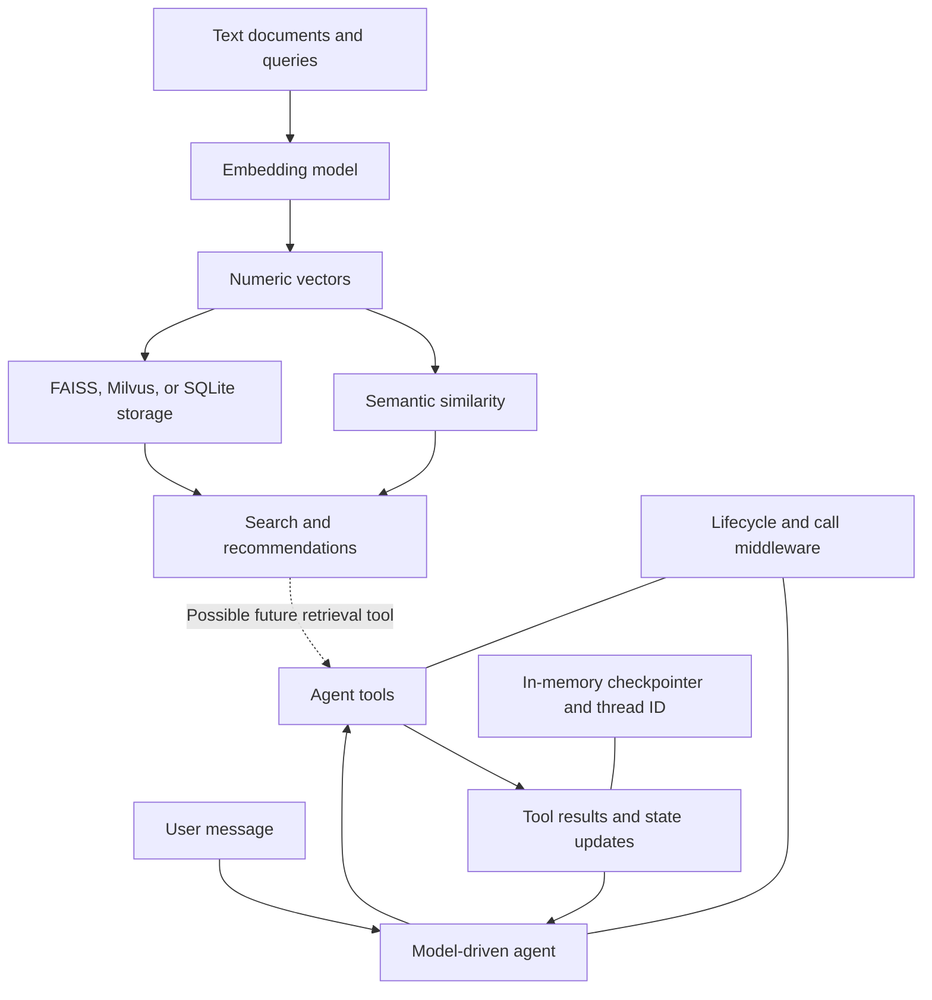

# Learning Summary: Embeddings, Agents, and Middleware

This folder explores **representing text as vectors**, **searching and storing those vectors**, and **building agents that use tools, maintain state, and apply middleware**. The examples are separate learning experiments, rather than one integrated application.

> [!info] Scope and evidence
> This note summarizes every top-level source, note, configuration, and lock file in the folder. Recorded embedding results come from `embeding.org`; agent behavior is described from source inspection, without running the scripts or making API calls. Git internals and generated Python bytecode are excluded from the learning material. Implementation caveats are distinguished from intended behavior.

## Contents

- [[#How the topics connect]]
- [[#Embeddings and semantic similarity]]
- [[#Vector search and recommendation]]
- [[#Storing embeddings in SQLite]]
- [[#Agents, tools, and persistent conversation state]]
- [[#Middleware lifecycle and composition]]
- [[#Customer support middleware example]]
- [[#Implementation caveats and lessons]]
- [[#Project environment and dependencies]]
- [[#Source file index]]

## How the topics connect



The **embedding examples** explain how to retrieve relevant information. The **agent examples** explain how a model chooses actions and uses their results. A retrieval tool could connect these ideas: search a vector store, return relevant text to an agent, and let the agent use it in its response. **That integration is a conceptual extension; it is not implemented in this folder.**

Three forms of memory appear here and serve different purposes:

| Mechanism      | What it holds                                                        | Purpose                                                    |
|----------------|----------------------------------------------------------------------|------------------------------------------------------------|
| Vector storage | Document embeddings and, depending on the example, text and metadata | Retrieve semantically related information                  |
| Agent state    | Messages and custom fields such as `first` and `second`              | Represent the current conversation and working values      |
| Checkpointer   | Agent state associated with a thread                                 | Carry state across invocations during the process lifetime |

Middleware controls how the agent operates: when calls run, which tools are allowed, how failures are handled, and what gets logged.

## Embeddings and semantic similarity

Source: [embeding.org](embeding.org), local-model and SQLite sections.

### Text becomes a numeric representation

An embedding model maps text to a vector. Comparing vectors provides a way to estimate semantic similarity without requiring identical wording.

The local example loads `SentenceTransformer("all-MiniLM-L6-v2")`, calls `model.encode(sentences)`, and compares the resulting vectors using `model.similarity(embeddings, embeddings)`.

It embeds three sentences:

1. “The weather is lovely today.”
2. “It's so sunny outside!”
3. “He drove to the stadium.”

The recorded embedding array has shape **`(3, 384)`**: three texts, each represented by 384 values.

| Sentence pair                     | Recorded similarity | Interpretation                 |
|-----------------------------------|--------------------:|--------------------------------|
| Each sentence with itself         |              1.0000 | Identical representation       |
| Weather and sunshine              |              0.6660 | Closely related subject matter |
| Weather and driving to a stadium  |              0.1046 | Weak relationship              |
| Sunshine and driving to a stadium |              0.1411 | Weak relationship              |

### Cosine similarity

The SQLite example implements cosine similarity explicitly:

$$
\operatorname{cosine\_similarity}(a,b)=\frac{a\cdot b}{\lVert a\rVert\lVert b\rVert}
$$

The numerator is the dot product; the denominator normalizes by vector length. This compares vector direction. The function returns `None` when either input is `None`, but does not guard against zero-length vectors.

**Relationship to retrieval:** a query and candidate documents must have compatible embeddings from the same embedding space. Similarity scores then provide a basis for ranking candidates. Equal dimensions alone do not establish compatibility between different models.

### Embedding models used in the notes

| Example                           | Model named in the source                       | Vector size shown in the notes               |
|-----------------------------------|-------------------------------------------------|----------------------------------------------|
| Direct local sentence comparison  | `all-MiniLM-L6-v2`                              | 384                                          |
| FAISS movie recommendation        | `sentence-transformers/all-MiniLM-L6-v2`        | Same named model family as the local example |
| Milvus default embedding function | Comment identifies `paraphrase-albert-small-v2` | 768                                          |
| SQLite persistence                | OpenAI `text-embedding-3-small`                 | Not explicitly reported                      |

These are the models recorded in the source, not a claim about current library defaults.

## Vector search and recommendation

Source: [embeding.org](embeding.org), recommendation and Milvus sections.

### FAISS movie recommendation

The recommendation example combines `HuggingFaceEmbeddings` with the LangChain community `FAISS` vector-store wrapper.

Its workflow is:

1. Define ten movie titles and their descriptions.
2. Embed the descriptions with `FAISS.from_texts(texts=descriptions, embedding=model)`.
3. Search using `similarity_search(query, k=2)`.
4. Match each returned document's `page_content` to the original description to recover its movie title.

The catalog contains **Inception, The Matrix, Interstellar, The Dark Knight, Forrest Gump, Gladiator, The Shawshank Redemption, Titanic, Avatar, and The Lord of the Rings**. Their descriptions cover dreams, simulated reality, space travel, moral conflict, personal history, revenge, prison and hope, romance, an alien world, and a fantasy quest.

For the query `I want to see a romatic story`, the saved output prints **The Shawshank Redemption** and **Titanic**.

> [!note] Interpreting the saved results
> The printing loop follows the original catalog order, so the displayed order does not establish the search ranking. The output also illustrates that semantic retrieval is approximate: a returned candidate need not be a perfect match for the user's intended genre.

The example uses parallel title and description lists. Storing movie titles in document metadata would make the relationship explicit and remove the need to recover titles through text equality.

### Milvus vector search with metadata filtering

The Milvus example adds a server-backed collection and structured metadata to the same embedding-and-search pattern.

| Setting               | Value in the source               |
|-----------------------|-----------------------------------|
| Active connection     | `http://localhost:19530`          |
| Commented alternative | `MilvusClient("milvus_demo.db")`  |
| Collection            | `demo_collection`                 |
| Vector dimension      | 768                               |
| Record fields         | `id`, `vector`, `text`, `subject` |
| Search result limit   | 2                                 |
| Returned fields       | `text`, `subject`                 |

The code drops `demo_collection` if it already exists, then recreates it. This makes the example repeatable by replacing its existing collection data.

The first batch contains three history texts about the founding of AI and Alan Turing. Documents are embedded with `encode_documents`; the query “Who is Alan Turing?” is embedded with `encode_queries`.

The saved results return:

- Turing's birthplace and upbringing, with a reported `distance` of approximately **0.5860**.
- Turing's early AI research, with a reported `distance` of approximately **0.5118**.

The second batch adds three biology texts about drug design, molecular-property prediction, and DDR1. The query “tell me AI related information” applies:

```python
filter="subject == 'biology'"
```

The recorded results contain the molecular-property and drug-design texts, with reported values of approximately **0.2703** and **0.1643**. History documents are excluded by the filter.

**Key relationship:** vector similarity ranks meaning-related candidates; metadata filters restrict which candidates are eligible. The code does not explicitly choose a distance metric, so the field name `distance` alone should not be used to infer score interpretation across systems.

The notes also include a commented Hugging Face mirror configuration for model-download failures and a commented random-query-vector placeholder. Random vectors can exercise a search interface but do not encode the meaning of a text query.

### Comparing the storage examples

| Approach                    | Demonstrated capability                 | Distinctive feature in this folder                              |
|-----------------------------|-----------------------------------------|-----------------------------------------------------------------|
| Direct Sentence Transformer | Pairwise vector comparison              | No vector store needed                                          |
| FAISS wrapper               | Top-k search over movie descriptions    | Short recommendation pipeline                                   |
| Milvus                      | Insert and search records with metadata | Collection schema and subject filtering                         |
| SQLite                      | Save and reload embedding bytes         | Manual serialization; no database similarity search implemented |

## Storing embeddings in SQLite

Source: [embeding.org](embeding.org), SQLite section.

### Vectorization and persistence workflow

`TextVectorizer` creates an OpenAI client from a passed API key or environment configuration and selects `text-embedding-3-small`.

Its `vectorize(text)` method:

1. Calls `client.embeddings.create(input=text, model=self.model)`.
2. Extracts `response.data[0].embedding`.
3. Converts the result to a NumPy array.
4. Prints an error and returns `None` if vectorization fails.

`compare_vectors` implements the cosine formula described in [[#Cosine similarity]], although the final demonstration does not call it.

The persistence functions use an `embeddings.db` SQLite database with this table:

```sql
CREATE TABLE IF NOT EXISTS embeddings (
    id INTEGER PRIMARY KEY AUTOINCREMENT,
    text TEXT,
    embedding BLOB
);
```

- `save_embeddings_to_db` converts vectors to bytes using `.tobytes()` and inserts text/BLOB pairs with parameterized SQL.
- `read_embeddings_from_db` selects all rows, decodes their bytes with `np.frombuffer(..., dtype=np.float32)`, and returns a dictionary keyed by text.
- The sample embeds three snippets about food and service, a movie, and a bad hotel experience, then saves and reloads them.

### Important serialization mismatch

> [!warning] The recorded SQLite output is not a reliable embedding round trip
> The writer uses `np.array(embedding)` without selecting a dtype, while the reader assumes `float32`. For a list of Python floats, NumPy normally creates a `float64` array. Reading those bytes as `float32` reinterprets the data rather than converting it. The saved output includes implausibly large values, consistent with this mismatch.

The learning point is to use the **same dtype at serialization and deserialization**, for example by explicitly converting to `float32` before writing. Recording model identity, dimension, and dtype would also make stored vectors easier to interpret later.

Other limitations visible in the source:

- Failed vectorization returns `None`, but saving assumes every value supports `.tobytes()`.
- Repeated runs insert duplicate rows; the table does not enforce unique text.
- Loading into a dictionary collapses duplicate text keys.
- The food snippet is embedded once before the main loop and again inside it; the first result is unused.
- Persistence is demonstrated, but a query-and-ranking workflow over the reloaded vectors is not implemented.

**Relationship to vector databases:** SQLite supplies storage here; the application would still need to compute or implement similarity search. The FAISS and Milvus examples already expose search operations.

## Agents, tools, and persistent conversation state

Source: [langchain_math.py](langchain_math.py), with the same basic agent pattern used by the middleware files.

### Agent construction and the tool loop

The examples combine:

- `ChatOpenAI`: the model interface.
- `@tool`: a Python function exposed as an agent tool, with a docstring explaining its purpose.
- `create_agent`: construction of the model/tool agent.
- Messages: user requests, model responses, and tool results.
- A checkpointer and `thread_id`: state continuity across invocations.

The math agent uses **`gpt-4o-mini`**. The support and middleware-order demonstrations use **`gpt-5-nano`**.

Conceptually, a user request reaches the model; the model may request a tool; the tool produces a result; the agent uses that result to continue or answer. One agent invocation can therefore involve multiple model calls and tool calls.

### Custom state in the math agent

`OperationState` extends `AgentState` with `first` and `second`. The initial invocation sets:

```python
first = 1000
second = 10
```

The system message instructs the model to use state values directly, call the appropriate arithmetic tool, and update `first` with each result.

| Tool            | Operation             | Effect on state                                           |
|-----------------|-----------------------|-----------------------------------------------------------|
| `add_tool`      | `first + second`      | Replaces `first` with the sum                             |
| `subtract_tool` | `first - second`      | Replaces `first` with the difference                      |
| `multiply_tool` | `first * second`      | Replaces `first` with the product                         |
| `divide_tool`   | `first / second`      | Replaces `first` with the quotient unless divisor is zero |
| `get_values`    | Reports both operands | No explicit custom-state update                           |

An illustrative sequence, derived from the code, is **1000 → add 10 → 1010 → multiply by 10 → 10100**. This is an explanation of the state transitions, not captured execution output.

### ToolRuntime, Command, and ToolMessage

The arithmetic tools obtain values from `runtime.state`. They return a `Command(update=...)` containing both:

1. The updated `first` value.
2. A `ToolMessage` describing the result and using `runtime.tool_call_id` to associate it with the requested call.

This links two forms of output: **machine-readable working state** and **a tool result the model can read**.

Division by zero returns an explanatory tool message without updating `first`. Other details to retain are that operand annotations are `int` even though division produces a float, and fallback values for `second` differ between some tools. The explicitly initialized value is 10.

### Checkpointing and the interactive loop

The math script uses `MemorySaver` with thread ID `demo-1`; the other scripts use `InMemorySaver` with their own fixed thread IDs. These are in-memory checkpointing examples, not durable storage across process restarts.

After initialization, `chat(message)` supplies only the new user message using the same thread configuration. The checkpointed state carries the arithmetic values and conversation forward. The loop prints the final response and current operands and exits on `quit`, `exit`, or `q`.

**Relationship to middleware:** tools implement domain actions and state changes; middleware controls the surrounding execution process.

## Middleware lifecycle and composition

Sources: [langchain_after_agent.py](langchain_after_agent.py), [langchain_wrap_model_call.py](langchain_wrap_model_call.py), [langchain_wrap_tool_call.py](langchain_wrap_tool_call.py), and [langchain_middleware.py](langchain_middleware.py).

### Lifecycle hooks versus wrappers

| Hook or wrapper   | Role illustrated in the files     | Example                                            |
|-------------------|-----------------------------------|----------------------------------------------------|
| `before_agent`    | Work at invocation start          | Logging and resetting counters                     |
| `before_model`    | Work before model execution       | Trimming message history                           |
| `after_model`     | Work after model execution        | Counting model calls                               |
| `after_agent`     | Work at invocation completion     | Logging summaries and cost estimates               |
| `wrap_model_call` | Surround a model call             | Print before and after generation                  |
| `wrap_tool_call`  | Surround or intercept a tool call | Authorization, limits, retries, and error handling |

Wrappers receive a `request` and a `handler`. Calling `handler(request)` delegates to the next layer. A wrapper can perform work before or after delegation, call the handler again for a retry, or return a result without delegating to block execution.

### Class-based and decorator-based middleware

The small demonstrations express the same middleware concept in two styles:

- A class inheriting from `AgentMiddleware`, with methods such as `wrap_tool_call`.
- A function decorated with `@wrap_tool_call`, `@wrap_model_call`, or `@after_agent`.

The class approach is used for configurable or stateful policies; decorated functions provide compact individual hooks.

### Wrapper order

Both wrapper demonstrations register a class first and a decorated function second. They are designed to demonstrate this nesting:

```text
Class wrapper: before
  Function wrapper: before
    Model or tool execution
  Function wrapper: after
Class wrapper: after
```

The first registered wrapper is the outer layer. Requests travel inward and responses return outward. This explains why registration order affects error handling, retry behavior, and what a counter measures.

| File                           | Demonstration                                                                                            |
|--------------------------------|----------------------------------------------------------------------------------------------------------|
| `langchain_wrap_model_call.py` | Class and function wrappers print around model generation; the user asks for “hello world”               |
| `langchain_wrap_tool_call.py`  | Class and function wrappers surround `system_error_tool`; the prompt requests reporting error code 500   |
| `langchain_after_agent.py`     | Class and decorated completion hooks print `[OUTER]` and `[INNER]` labels to inspect completion ordering |

The completion-hook file includes no saved execution output. Its labels express the intended ordering experiment; they are not an execution trace. Unlike a wrapper, an `after_agent` hook does not manually call a handler to nest execution.

A requested tool call still depends on the agent's model response. The tool-wrapper script prints the final reply to help inspect what actually happened.

## Customer support middleware example

Source: [langchain_middleware.py](langchain_middleware.py).

### Business tools and access tiers

| Tool                 | Intended purpose                     | Access policy in this example             |
|----------------------|--------------------------------------|-------------------------------------------|
| `check_order_status` | Return an order status               | Basic and premium                         |
| `reset_password`     | Return a password-reset confirmation | Basic and premium                         |
| `refund_order`       | Return a refund confirmation         | Premium only                              |
| `escalate_to_human`  | Return a support-ticket confirmation | Premium only                              |
| `process_payment`    | Return success or raise above 1000   | Defined but not registered with the agent |

These functions return simulated responses. They do not actually look up orders, send emails, transfer money, or create tickets.

### Registered middleware and its responsibilities

The agent registers these layers in this order:

1. **`LoggingMiddleware`** logs start and end timestamps and summarizes retained messages and messages containing tool calls.
2. **`MessageTrimmingMiddleware(max_messages=20)`** removes the oldest messages with `RemoveMessage` when history exceeds 20 messages. The class default is 10, but this agent overrides it.
3. **`ToolAuthorizationMiddleware(user_tier=...)`** checks the tool name and returns an access-denied `ToolMessage` for premium tools requested by basic users.
4. **`CostTrackingMiddleware`** maintains per-turn and cumulative counters and prints illustrative costs.
5. **`RateLimitingMiddleware`** resets at invocation start and allows up to five tool calls before returning a limit message.
6. **`handle_tool_errors`** logs tool execution and converts caught exceptions to `ToolMessage` responses, truncating exception text to 100 characters.
7. **`retry_tool_calls`** calls the handler up to three times, with waits of one and two seconds before subsequent attempts.

The interactive agent starts as a **basic** user and reuses thread ID `interactive-demo-1`. It skips blank input, prints the final assistant response, and accepts `quit`, `exit`, or `q` to leave.

### How the policies interact

**Authorization and execution:** returning a denial message without calling `handler` prevents the protected tool from executing. The retry function also avoids retrying exceptions whose text contains “Access denied” or “requires premium”; however, the authorization middleware here returns a message rather than raising such an exception.

**Retries and error conversion:** retries need an exception to reach their handler. If an inner layer converts an error into a normal response, retry logic cannot detect failure through its `except` branch. The listed retry wrapper sits inside the custom error-handling wrapper. Exceptions that reach it receive at most three attempts; after exhaustion it returns its own tool message.

**Limits and retries:** with the limiter outside retry handling, an outer tool request and its internal retry attempts are different counting units. A limit on outer calls should not automatically be interpreted as a limit on every underlying attempt.

**State and trimming:** checkpointing preserves conversation state, while trimming removes older messages from that state. These mechanisms complement one another, but retaining state does not mean retaining the entire conversation indefinitely.

**Observability and cost:** logs describe execution; counters estimate resource usage. The sample uses fixed values of `0.01` per model call and `0.001` per tool call. These are illustrative constants, not verified provider pricing or token-based billing.

## Implementation caveats and lessons

These observations come from reading the examples. They are useful qualifications to the learning material, rather than changes made to the source files.

| Area                       | Observation                                                                                                 | Why it matters                                                                                                           |
|----------------------------|-------------------------------------------------------------------------------------------------------------|--------------------------------------------------------------------------------------------------------------------------|
| SQLite serialization       | Writer leaves dtype implicit; reader assumes `float32`                                                      | Stored vectors can be reconstructed incorrectly; see [[#Important serialization mismatch]]                               |
| Tool cost tracking         | Tool counters are incremented only in a method named `after_tool`, with no explicit call to it in this file | Tool accounting is not established by the source; this hook needs validation against the installed middleware interface  |
| Logging statistics         | Counts messages that have tool calls, not the length of each `tool_calls` list                              | One message with multiple calls counts as one; retained earlier turns may also be included                               |
| Retry wording              | `max_retries = 3` drives three total attempts                                                               | The final message says “3 retries,” although only two repeat attempts occur                                              |
| Failure demonstration      | `process_payment` raises on large amounts but is absent from the registered tool list                       | The intended failure case is not available to this agent                                                                 |
| History trimming           | Removes oldest messages by count                                                                            | Can discard initial context or separate a tool-call message from its result; message count also differs from token count |
| Numeric state              | Fields are annotated as integers; division yields a float                                                   | The schema does not accurately describe every resulting value                                                            |
| API-key handling           | Math example applies `str()` to `os.getenv(...)`                                                            | An absent value becomes the string `"None"`                                                                              |
| Demonstration comments     | Model-wrapper file says a tool is needed for agent validity                                                 | The example itself does not establish that general requirement                                                           |
| Startup behavior           | Agent files execute calls or interactive loops at module level                                              | Importing them can trigger model requests or wait for input                                                              |
| Production-readiness claim | Support script prints “Production-ready”                                                                    | This is a source string, not evidence of production validation                                                           |

The middleware counters live on object instances. The examples illustrate serial interactive use; they do not demonstrate isolation of mutable counters across concurrent invocations.

## Project environment and dependencies

Sources: [pyproject.toml](pyproject.toml), [uv.lock](uv.lock), [.python-version](.python-version), [.gitignore](.gitignore), [main.py](main.py), and [README.md](README.md).

### Project configuration

- Project name: `learning`.
- Project version: `0.1.0`.
- Required Python: `>=3.13`; `.python-version` selects `3.13`.
- Description remains a placeholder; `README.md` is empty.
- `main.py` only prints `Hello from learning!`; it does not launch the learning examples.
- The `ty` configuration ignores `unknown-argument`; comments show other possible rule suppressions without enabling them.
- `.gitignore` excludes Python bytecode/cache files, build/distribution outputs, wheel and egg metadata, and `.venv`.

### Declared and locked dependencies

| Direct dependency  | Declared minimum | Locked version |
|--------------------|------------------|----------------|
| `ipython`          | 9.9.0            | 9.9.0          |
| `langchain`        | 1.2.2            | 1.2.2          |
| `langchain-openai` | 1.1.7            | 1.1.7          |
| `langgraph`        | 1.0.5            | 1.0.5          |

`uv.lock` records the resolved dependency graph and package distribution locations, hashes, and sizes. Its format version is 1, revision 3, and its Python requirement is `>=3.13`. Distribution-level entries support reproducible dependency resolution rather than adding new learning topics.

Important locked supporting packages include:

| Group                          | Packages and role in the dependency graph                                     |
|--------------------------------|-------------------------------------------------------------------------------|
| Agent foundations              | `langchain-core 1.2.6`, `langgraph-prebuilt 1.0.5`                            |
| Checkpointing and graph access | `langgraph-checkpoint 3.0.1`, `langgraph-sdk 0.3.1`                           |
| Model access and tokenization  | `openai 2.14.0`, `tiktoken 0.12.0`                                            |
| Validation and typing          | `pydantic 2.12.5`, `pydantic-core 2.41.5`, typing support packages            |
| Tracing-related dependency     | `langsmith 0.6.1`; its presence does not establish configured tracing         |
| Transport and serialization    | HTTP clients, JSON/MessagePack libraries, compression and hashing utilities   |
| Interactive development        | IPython's prompt, syntax highlighting, completion, and traceback dependencies |

The Org embedding examples import additional packages not declared in `pyproject.toml` or present in this lockfile: **`sentence_transformers`, `langchain_community`, `pymilvus`, and NumPy**, with FAISS support also needed for the FAISS example. The project dependency files therefore do not fully capture the embedding notebook environment.

The model-backed examples expect API credentials through `OPENAI_API_KEY` or the client configuration used in the source. The active Milvus example expects a running local server. No database files or model artifacts are included among the top-level files.

## Source file index

| File                                                         | Content                                                                                            | Main sections in this summary                                                                                     |
|--------------------------------------------------------------|----------------------------------------------------------------------------------------------------|-------------------------------------------------------------------------------------------------------------------|
| [embeding.org](embeding.org)                                 | Four embedding examples with saved outputs: local similarity, movie recommendation, Milvus, SQLite | [[#Embeddings and semantic similarity]], [[#Vector search and recommendation]], [[#Storing embeddings in SQLite]] |
| [langchain_math.py](langchain_math.py)                       | Stateful arithmetic tools and an interactive agent                                                 | [[#Agents, tools, and persistent conversation state]]                                                             |
| [langchain_middleware.py](langchain_middleware.py)           | Support tools, authorization, trimming, logging, call limits, retries, errors, and cost tracking   | [[#Customer support middleware example]], [[#Implementation caveats and lessons]]                                 |
| [langchain_after_agent.py](langchain_after_agent.py)         | Class and decorator completion-hook experiment                                                     | [[#Middleware lifecycle and composition]]                                                                         |
| [langchain_wrap_model_call.py](langchain_wrap_model_call.py) | Nested class/function model-call wrappers                                                          | [[#Wrapper order]]                                                                                                |
| [langchain_wrap_tool_call.py](langchain_wrap_tool_call.py)   | Nested class/function tool-call wrappers                                                           | [[#Wrapper order]]                                                                                                |
| [main.py](main.py)                                           | Hello-world entry point                                                                            | [[#Project environment and dependencies]]                                                                         |
| [pyproject.toml](pyproject.toml)                             | Project metadata, Python requirement, dependencies, and type-checker setting                       | [[#Project environment and dependencies]]                                                                         |
| [uv.lock](uv.lock)                                           | Resolved versions, dependency relationships, and distribution metadata                             | [[#Declared and locked dependencies]]                                                                             |
| [.python-version](.python-version)                           | Python 3.13 selection                                                                              | [[#Project configuration]]                                                                                        |
| [.gitignore](.gitignore)                                     | Generated-file and environment exclusions                                                          | [[#Project configuration]]                                                                                        |
| [README.md](README.md)                                       | Empty                                                                                              | [[#Project configuration]]                                                                                        |

For studying these topics in sequence, follow **embeddings → similarity → vector search and storage → agent tools → custom state and checkpointing → middleware composition → the combined support example**. Source-file links are relative to this note, so keep the note beside the original files if you want those links to resolve after moving the folder into an Obsidian vault.
