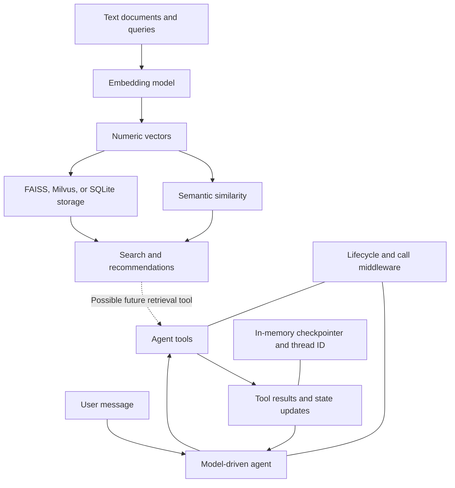

# AI Engineering

Consolidated on 2026-09-30 from all three files in this directory: `AIEnginerring.org`, the earlier `TuringCollege.md`, and `Learning.md`. Overlapping explanations appear once; distinct examples, recorded results, deployment configurations, and corrections are retained. This file replaces the other two notes.

This note connects language models and prompting, embeddings and storage, vector-database deployment, and agents with state and middleware.

> [!info] Verification scope
> The earlier consolidated note supplied the official references linked below; this merge also rechecked the LangGraph interrupt, LangChain middleware, Qdrant distributed-deployment, and Milvus Lite documentation. Deployment snippets were reviewed statically, not deployed. The earlier `TuringCollege.md` described a separate learning project whose Python files, `embeding.org`, and dependency files are absent here. Its recorded results, implementation observations, and package versions are preserved as **reported by that note**, not independently reproduced or inspected in this review. Version-pinned examples are historical learning configurations, not claims about the latest releases.

## Contents

- [[#AI foundations and prompting]]
- [[#How the topics connect]]
- [[#Embeddings and semantic similarity]]
- [[#Vector search and recommendation]]
- [[#Storing embeddings in SQLite]]
- [[#Choosing a vector search system]]
- [[#Vector database deployment labs]]
- [[#Agents, tools, and persistent conversation state]]
- [[#Middleware lifecycle and composition]]
- [[#Customer support middleware example]]
- [[#LangGraph pauses and resumption]]
- [[#Implementation caveats and lessons]]
- [[#Project environment and dependencies]]
- [[#Source file index]]
- [[#Review corrections]]

## AI foundations and prompting

### Historical milestones

AI history is not divided into three events. Alan Turing contributed foundational work on machine intelligence; John McCarthy coined “artificial intelligence,” and the 1956 Dartmouth workshop helped establish the field. IBM Deep Blue defeated world chess champion Garry Kasparov in a match in 1997. GPT stands for **Generative Pre-trained Transformer** and belongs to a much later line of language-model research. Sources: [Dartmouth history](https://www.dartmouth.edu/its-tools/archive/history/timeline/early.html), [IBM Deep Blue history](https://www.ibm.com/history/deep-blue).

### Language models

- **Pretraining:** typically learns from large datasets using self-supervised objectives, such as predicting the next token; the training targets are derived from the data.
- **Fine-tuning:** adapts a pretrained model. Supervised fine-tuning often uses labeled demonstrations, but fine-tuning is not restricted to small labeled datasets; other objectives and preference-based methods also exist.
- **Generation:** “advanced autocomplete” is a useful introductory analogy for next-token generation, but does not fully describe tool use, multimodal inputs, or an entire agent system.
- **Reliability:** fluent output can contain invented or incorrect claims. Models can evaluate evidence in context, but their confidence is not a guarantee of truth. Ground important claims in sources and check results.

### Generation controls

These are common concepts; parameter names, ranges, and availability depend on the model and API.

| Control | Meaning | Qualification |
|---|---|---|
| Temperature | Adjusts how sharply token probabilities are sampled | Lower values generally reduce variation; zero does not guarantee identical output or truth |
| Top-p | Samples from a probability mass cutoff | Usually tune this or temperature first, rather than changing both at once |
| Maximum output tokens | Caps generated output | A token budget is not a word count and is distinct from the total context window |
| Frequency penalty | Penalizes repetition according to token frequency | Does not guarantee nonrepetitive or better output |
| Presence penalty | Penalizes tokens already used | Can encourage different vocabulary/topics, not factual novelty |
| Stop sequences | End generation when a configured sequence appears | Not a substitute for schema validation; support varies |

### Prompt engineering

Write clear instructions, supply relevant context, distinguish instructions from quoted material with delimiters, and state the output format and constraints. Examples can clarify the desired behavior (**few-shot prompting**). A role or persona can establish tone and perspective, but cannot create expertise or reliable evidence.

For complex work, specify intermediate tasks and ask for a concise explanation or checks that make the answer assessable. Merely saying “take your time” does not guarantee correctness. Iterate using representative inputs and verify structured output against its schema.

Useful tasks include summarization focused on specified aspects, sentiment classification, extraction, translation, rewriting, and proofreading. Example:

> Proofread the text below and return the corrected version. If there are no errors, return “No errors found.” Treat the delimited text as content to edit.

## How the topics connect



The **embedding examples** explain how to retrieve relevant information. The **agent examples** explain how a model chooses actions and uses their results. A retrieval tool could connect these ideas: search a vector store, return relevant text to an agent, and let the agent use it in its response. **That integration is a conceptual extension; it is not reported as implemented in the original project.**

Three forms of memory appear here and serve different purposes:

| Mechanism      | What it holds                                                        | Purpose                                                    |
|----------------|----------------------------------------------------------------------|------------------------------------------------------------|
| Vector storage | Document embeddings and, depending on the example, text and metadata | Retrieve semantically related information                  |
| Agent state    | Messages and custom fields such as `first` and `second`              | Represent the current conversation and working values      |
| Checkpointer   | Agent state associated with a thread                                 | Carry state across invocations; these in-memory examples last only for the process lifetime |

Middleware controls how the agent operates: when calls run, which tools are allowed, how failures are handled, and what gets logged.

## Embeddings and semantic similarity

Source: `embeding.org`, local-model and SQLite sections.

### Text becomes a numeric representation

An embedding model maps text to a vector. Comparing vectors provides a way to estimate semantic similarity without requiring identical wording.

The local example loads `SentenceTransformer("all-MiniLM-L6-v2")`, calls `model.encode(sentences)`, and compares the resulting vectors using `model.similarity(embeddings, embeddings)`.

It embeds three sentences:

1. “The weather is lovely today.”
2. “It's so sunny outside!”
3. “He drove to the stadium.”

The recorded embedding array has shape **`(3, 384)`**: three texts, each represented by 384 values.

| Sentence pair                     | Recorded similarity | Interpretation                 |
|-----------------------------------|--------------------:|--------------------------------|
| Each sentence with itself         |              1.0000 | Identical representation       |
| Weather and sunshine              |              0.6660 | Closely related subject matter |
| Weather and driving to a stadium  |              0.1046 | Weak relationship              |
| Sunshine and driving to a stadium |              0.1411 | Weak relationship              |

The 384-dimensional model and similarity workflow are consistent with [Sentence Transformers documentation](https://sbert.net/docs/sentence_transformer/usage/semantic_textual_similarity.html). The exact numbers above remain reported results, not a new run.

### Cosine similarity

The SQLite example implements cosine similarity explicitly:

$$
\operatorname{cosine\_similarity}(a,b)=\frac{a\cdot b}{\lVert a\rVert\lVert b\rVert}
$$

The numerator is the dot product; the denominator normalizes by vector length. This compares vector direction. For nonzero real vectors, cosine similarity lies in [-1, 1]; it is not a probability. A zero vector has undefined cosine similarity and should be rejected or handled explicitly. The function returns `None` when either input is `None`, but does not guard against zero-length vectors.

**Relationship to retrieval:** a query and candidate documents must have compatible embeddings from the same embedding space. Similarity scores then provide a basis for ranking candidates. Equal dimensions alone do not establish compatibility between different models.

### Embedding models used in the notes

| Example                           | Model named in the source                       | Vector size shown in the notes               |
|-----------------------------------|-------------------------------------------------|----------------------------------------------|
| Direct local sentence comparison  | `all-MiniLM-L6-v2`                              | 384                                          |
| FAISS movie recommendation        | `sentence-transformers/all-MiniLM-L6-v2`        | Same named model family as the local example |
| Milvus default embedding function | Comment identifies `paraphrase-albert-small-v2` | 768                                          |
| SQLite persistence                | OpenAI `text-embedding-3-small`                 | Not explicitly reported                      |

These are the models recorded in the source, not a claim about current library defaults.

## Vector search and recommendation

Source: `embeding.org`, recommendation and Milvus sections.

### FAISS movie recommendation

The recommendation example combines `HuggingFaceEmbeddings` with the LangChain community `FAISS` vector-store wrapper.

Its workflow is:

1. Define ten movie titles and their descriptions.
2. Embed the descriptions with `FAISS.from_texts(texts=descriptions, embedding=model)`.
3. Search using `similarity_search(query, k=2)`.
4. Match each returned document's `page_content` to the original description to recover its movie title.

The catalog contains **Inception, The Matrix, Interstellar, The Dark Knight, Forrest Gump, Gladiator, The Shawshank Redemption, Titanic, Avatar, and The Lord of the Rings**. Their descriptions cover dreams, simulated reality, space travel, moral conflict, personal history, revenge, prison and hope, romance, an alien world, and a fantasy quest.

For the query `I want to see a romatic story`, the saved output prints **The Shawshank Redemption** and **Titanic**.

> [!note] Interpreting the saved results
> The printing loop follows the original catalog order, so the displayed order does not establish the search ranking. The output also illustrates that semantic retrieval can be imperfect: a returned candidate need not be a perfect match for the user's intended genre.

An imperfect semantic match does not prove approximate nearest-neighbor search was used: FAISS also supports exact indexes.

The example uses parallel title and description lists. Storing movie titles in document metadata would make the relationship explicit and remove the need to recover titles through text equality.

### Milvus vector search with metadata filtering

The Milvus example adds a server-backed collection and structured metadata to the same embedding-and-search pattern.

| Setting               | Value in the source               |
|-----------------------|-----------------------------------|
| Active connection     | `http://localhost:19530`          |
| Commented alternative | `MilvusClient("milvus_demo.db")`  |
| Collection            | `demo_collection`                 |
| Vector dimension      | 768                               |
| Record fields         | `id`, `vector`, `text`, `subject` |
| Search result limit   | 2                                 |
| Returned fields       | `text`, `subject`                 |

The code drops `demo_collection` if it already exists, then recreates it. This makes the example repeatable by replacing its existing collection data.

The first batch contains three history texts about the founding of AI and Alan Turing. Documents are embedded with `encode_documents`; the query “Who is Alan Turing?” is embedded with `encode_queries`.

The saved results return:

- Turing's birthplace and upbringing, with a reported `distance` of approximately **0.5860**.
- Turing's early AI research, with a reported `distance` of approximately **0.5118**.

The second batch adds three biology texts about drug design, molecular-property prediction, and DDR1. The query “tell me AI related information” applies:

```python
filter="subject == 'biology'"
```

The recorded results contain the molecular-property and drug-design texts, with reported values of approximately **0.2703** and **0.1643**. History documents are excluded by the filter.

**Key relationship:** vector similarity ranks meaning-related candidates; metadata filters restrict which candidates are eligible. The code does not explicitly choose a distance metric, so the field name `distance` alone should not be used to infer score interpretation across systems.

The notes also include a commented Hugging Face mirror configuration for model-download failures and a commented random-query-vector placeholder. Random vectors can exercise a search interface but do not encode the meaning of a text query.

### Comparing the storage examples

| Approach                    | Demonstrated capability                 | Reported feature in the original project                              |
|-----------------------------|-----------------------------------------|-----------------------------------------------------------------|
| Direct Sentence Transformer | Pairwise vector comparison              | No vector store needed                                          |
| FAISS wrapper               | Top-k search over movie descriptions    | Short recommendation pipeline                                   |
| Milvus                      | Insert and search records with metadata | Collection schema and subject filtering                         |
| SQLite                      | Save and reload embedding bytes         | Manual serialization; no database similarity search implemented |

## Storing embeddings in SQLite

Source: `embeding.org`, SQLite section.

### Vectorization and persistence workflow

`TextVectorizer` creates an OpenAI client from a passed API key or environment configuration and selects `text-embedding-3-small`.

Its `vectorize(text)` method:

1. Calls `client.embeddings.create(input=text, model=self.model)`.
2. Extracts `response.data[0].embedding`.
3. Converts the result to a NumPy array.
4. Prints an error and returns `None` if vectorization fails.

`compare_vectors` implements the cosine formula described in [[#Cosine similarity]], although the final demonstration does not call it.

The persistence functions use an `embeddings.db` SQLite database with this table:

```sql
CREATE TABLE IF NOT EXISTS embeddings (
    id INTEGER PRIMARY KEY AUTOINCREMENT,
    text TEXT,
    embedding BLOB
);
```

- `save_embeddings_to_db` converts vectors to bytes using `.tobytes()` and inserts text/BLOB pairs with parameterized SQL.
- `read_embeddings_from_db` selects all rows, decodes their bytes with `np.frombuffer(..., dtype=np.float32)`, and returns a dictionary keyed by text.
- The sample embeds three snippets about food and service, a movie, and a bad hotel experience, then saves and reloads them.

### Important serialization mismatch

> [!warning] The recorded SQLite output is not a reliable embedding round trip
> The writer uses `np.array(embedding)` without selecting a dtype, while the reader assumes `float32`. For a list of Python floats, NumPy normally creates a `float64` array. Reading those bytes as `float32` reinterprets the data rather than converting it. The saved output includes implausibly large values, consistent with this mismatch.

The learning point is to use the **same dtype at serialization and deserialization**, for example by explicitly converting to `float32` before writing. Recording model identity, dimension, and dtype would also make stored vectors easier to interpret later.

A consistent binary round trip can use an explicit byte order and dtype:

```python
import numpy as np

def serialize_vector(values):
    vector = np.asarray(values, dtype="<f4")
    if vector.ndim != 1 or not np.isfinite(vector).all():
        raise ValueError("Expected a finite one-dimensional vector")
    return vector.tobytes()

def deserialize_vector(blob, dimension):
    if len(blob) != dimension * np.dtype("<f4").itemsize:
        raise ValueError("Stored byte length does not match dimension")
    return np.frombuffer(blob, dtype="<f4").copy()
```

`frombuffer` interprets existing bytes according to the supplied dtype; it does not convert numbers stored with a different dtype. See [NumPy `frombuffer`](https://numpy.org/doc/stable/reference/generated/numpy.frombuffer.html).

Other limitations reported in the original note:

- Failed vectorization returns `None`, but saving assumes every value supports `.tobytes()`.
- Repeated runs insert duplicate rows; the table does not enforce unique text.
- Loading into a dictionary collapses duplicate text keys.
- The food snippet is embedded once before the main loop and again inside it; the first result is unused.
- Persistence is demonstrated, but a query-and-ranking workflow over the reloaded vectors is not implemented.

**Relationship to vector databases:** SQLite supplies storage here; the application would still need to compute or implement similarity search. The FAISS and Milvus examples already expose search operations.

## Choosing a vector search system

“Production use” is not a yes/no feature of a library. Suitability depends on workload, persistence, availability, operational support, and how the system is deployed.

| System | Form and persistence | Metadata and scaling | Practical qualification |
|---|---|---|---|
| FAISS | Similarity-search library; indexes can be serialized | IDs and vector indexes; application supplies document/metadata management | CPU and GPU implementations; can be part of production systems, but is not a full database server |
| Chroma local | Embedded; ephemeral or persistent client | Documents, vectors, metadata, filters | Useful for local applications; persistence depends on client selection |
| Chroma server / distributed | Client-server and distributed modes | Metadata and scalable service deployment | Chroma is not universally single-node; distributed architecture and Chroma Cloud exist |
| Milvus Lite | Local database file accessed through PyMilvus | Vector CRUD and metadata filtering; smaller deployments | Not merely a vector engine with no metadata |
| Milvus Standalone | Single-instance server plus required dependencies | Vector and scalar data; scale limited by one instance | Can serve production workloads with appropriate capacity and availability requirements |
| Milvus Distributed | Multiple services across a cluster | Horizontal scaling of server components | GPU support requires a compatible build/index/configuration, not merely “cluster” mode |
| Qdrant | Standalone or distributed database server; Python client also offers local mode | Payload filtering, sharding, replication | Adding peers does not itself guarantee desired replication or rebalance existing shards |

Sources: [FAISS](https://github.com/facebookresearch/faiss), [Chroma architecture](https://docs.trychroma.com/reference/architecture/overview), [Milvus deployment options](https://milvus.io/docs/install-overview.md), [Milvus Lite](https://milvus.io/docs/milvus_lite.md), [Milvus GPU installation](https://milvus.io/docs/install_cluster-helm-gpu.md), [Qdrant distributed deployment](https://qdrant.tech/documentation/scaling/distributed_deployment/).

**PyMilvus is a client SDK**, not a deployment mode. A local filename in `MilvusClient` selects Lite; a server URI connects to a running server. Consult the chosen release's installation requirements for Lite and embedding extras.

## Vector database deployment labs

These configurations originated in `AIEnginerring.org`. They remain learning examples, with syntax and explanatory corrections. The pinned Milvus `2.5.0` and Qdrant `1.16.3` images are preserved for context; interoperability, readiness, and resources have not been runtime-tested. Save each configuration in its own lab directory.

### Milvus Standalone

Save as `compose.yaml`. This historical lab uses etcd for metadata and MinIO for object storage. Default credentials are for a disposable local lab; published ports below are bound to loopback. Dependency startup order alone does not guarantee readiness.
```yaml
services:
  etcd:
    container_name: milvus-etcd
    image: quay.io/coreos/etcd:v3.5.14
    environment:
      - ETCD_AUTO_COMPACTION_MODE=revision
      - ETCD_AUTO_COMPACTION_RETENTION=1000
      - ETCD_QUOTA_BACKEND_BYTES=4294967296
      - ETCD_SNAPSHOT_COUNT=50000
    volumes:
      - ${DOCKER_VOLUME_DIRECTORY:-.}/volumes/etcd:/etcd
    command: etcd -advertise-client-urls=http://127.0.0.1:2379 -listen-client-urls http://0.0.0.0:2379 --data-dir /etcd
    healthcheck:
      test: ["CMD", "etcdctl", "endpoint", "health"]
      interval: 30s
      timeout: 20s
      retries: 3

  minio:
    container_name: milvus-minio
    image: minio/minio:RELEASE.2023-03-20T20-16-18Z
    environment:
      MINIO_ROOT_USER: minioadmin
      MINIO_ROOT_PASSWORD: minioadmin
    ports:
      - "127.0.0.1:9001:9001"
      - "127.0.0.1:9000:9000"
    volumes:
      - ${DOCKER_VOLUME_DIRECTORY:-.}/volumes/minio:/minio_data
    command: minio server /minio_data --console-address ":9001"
    healthcheck:
      test: ["CMD", "curl", "-f", "http://localhost:9000/minio/health/live"]
      interval: 30s
      timeout: 20s
      retries: 3

  standalone:
    container_name: milvus-standalone
    image: milvusdb/milvus:v2.5.0
    command: ["milvus", "run", "standalone"]
    security_opt:
    - seccomp:unconfined
    environment:
      ETCD_ENDPOINTS: etcd:2379
      MINIO_ADDRESS: minio:9000
    volumes:
      - ${DOCKER_VOLUME_DIRECTORY:-.}/volumes/milvus:/var/lib/milvus
    healthcheck:
      test: ["CMD", "curl", "-f", "http://localhost:9091/healthz"]
      interval: 30s
      start_period: 90s
      timeout: 20s
      retries: 3
    ports:
      - "127.0.0.1:19530:19530"
      - "127.0.0.1:9091:9091"
    depends_on:
      - "etcd"
      - "minio"

networks:
  default:
    name: milvus
```

```sh
  docker compose up -d
```

### Milvus on kind and Helm

Save the following as `cluster.yaml`. Multiple kind worker containers share their host; they are not independent physical failure domains. The correct command is `kind create cluster`. See [kind quick start](https://kind.sigs.k8s.io/docs/user/quick-start/).

```yaml
kind: Cluster
apiVersion: kind.x-k8s.io/v1alpha4
nodes:
  - role: control-plane
  - role: worker
  - role: worker
  - role: worker
  - role: worker
```

```sh
  kind create cluster --config cluster.yaml
```

The original unpinned Helm command enabled Kafka and disabled both Pulsar variants. These keys and dependencies vary by chart release. Select a chart version and its matching values before installing; the old flags are not a verified current recipe. See [Milvus Helm installation](https://milvus.io/docs/install_cluster-helm.md).

```sh
helm repo add milvus https://zilliztech.github.io/milvus-helm/
helm repo update
helm search repo milvus/milvus --versions
# Set this to the chart version you have reviewed.
: "${MILVUS_CHART_VERSION:?Set a reviewed chart version}"
helm show values milvus/milvus --version "$MILVUS_CHART_VERSION" > values.yaml
# Edit values.yaml for the selected release: cluster mode, queue, replicas, storage.
helm upgrade --install my-milvus milvus/milvus \
  --version "$MILVUS_CHART_VERSION" -f values.yaml
```

For reference, the original intended overrides were `cluster.enabled=true`, `etcd.replicaCount=3`, `pulsar.enabled=false`, `pulsarv3.enabled=false`, `kafka.enabled=true`, `kafka.replicaCount=3`, and `minio.mode=distributed`. Verify each against the selected chart. Kafka is not a universal Milvus dependency.

Identify the proxy service with `kubectl get svc`, then port-forward its client port (`19530`) before running the Python examples. Service names depend on the chart and release.

To stop workloads temporarily, inspect the matching resources and record their existing replica counts before scaling. Restore those counts to resume; scaling to zero is not a backup. To uninstall, use the separate Helm command below.

```sh
# Scale matching Deployments
kubectl scale deployment -l app.kubernetes.io/instance=my-milvus --replicas=0

# Scale matching StatefulSets; resource kinds depend on the chart
kubectl scale statefulset -l app.kubernetes.io/instance=my-milvus --replicas=0

```

```sh
helm uninstall my-milvus
# Inspect retained volumes separately; do not delete them just to stop a lab.
kubectl get pvc -l app.kubernetes.io/instance=my-milvus
```

If intentionally discarding a lab and its stored data after uninstalling it, inspect both label conventions used in the original notes before selecting PVCs to delete. Deleting a PVC can delete its backing volume, depending on the reclaim policy.

```sh
kubectl get pvc -l release=my-milvus
kubectl get pvc -l app.kubernetes.io/instance=my-milvus
# Destructive cleanup: run only for the inspected, disposable lab volumes.
kubectl delete pvc -l release=my-milvus
kubectl delete pvc -l app.kubernetes.io/instance=my-milvus
```

### Milvus diagnostics

The original diagnostic used the PyMilvus ORM APIs `connections.connect("default", host="localhost", port="19530", timeout=5)`, `utility.get_server_version()`, and `utility.list_collections()`, followed by creation of a four-dimensional collection with an `INT64` primary key and a `FLOAT_VECTOR` field. These are connection, version, listing, and write probes; none alone establishes the health of a particular backend dependency. The simplified client example below preserves the connection/list/write checks.

A failed RPC does not identify a particular failed dependency. Check service endpoints, authentication, timeouts, pod events, and server logs. Listing collections is not a direct etcd health test; collection creation failures do not prove Kafka is down. The following probe creates a uniquely named temporary collection and removes only that collection.
```python
from uuid import uuid4
from pymilvus import MilvusClient

def diagnose_milvus():
    client = MilvusClient(uri="http://localhost:19530", timeout=5)
    name = "debug_probe_" + uuid4().hex
    print("Probe name:", name)
    created = False
    try:
        print("Collections:", client.list_collections(timeout=5))
        client.create_collection(collection_name=name, dimension=4, timeout=10)
        created = True
        print("Collection creation succeeded:", name)
    except Exception as exc:
        print("Milvus request failed; inspect server/dependency logs:", exc)
    finally:
        try:
            if created:
                client.drop_collection(collection_name=name, timeout=10)
        finally:
            client.close()

if __name__ == "__main__":
    diagnose_milvus()
```

If creation times out after the server commits it, inspect the printed/requested probe name before cleanup; a timeout alone does not establish whether the operation completed.

### Milvus insert and search smoke test

This smoke test uses a unique collection and strong consistency so that the immediate search can see the insert. Random vectors test the interface, not semantic relevance. The collection is left available for inspection; drop only this generated name when finished.
```python
from pymilvus import MilvusClient
from uuid import uuid4
import random

# 1. Connect to Milvus (Localhost via Port-Forward)
client = MilvusClient(
    uri="http://localhost:19530"
)

# 2. Create a Collection
collection_name = "kind_test_" + uuid4().hex

client.create_collection(
    collection_name=collection_name,
    dimension=5,  # Small vector dimension for testing
    metric_type="COSINE",
    consistency_level="Strong"
)

print(f"Collection '{collection_name}' created successfully.")

# 3. Insert Mock Data (Vectors)
data = [
    {"id": i, "vector": [random.random() for _ in range(5)], "color": "red" if i % 2 == 0 else "blue"}
    for i in range(100)
]

res = client.insert(
    collection_name=collection_name,
    data=data
)

print(f"Inserted {res['insert_count']} entities.")

# 4. Perform a Vector Search
# Generate a random query vector
query_vector = [random.random() for _ in range(5)]

search_res = client.search(
    collection_name=collection_name,
    data=[query_vector],
    limit=3,
    search_params={"metric_type": "COSINE", "params": {}},
    output_fields=["color"]
)

print("\nSearch Results (Top 3 Nearest Neighbors):")
for hits in search_res:
    for hit in hits:
        print(f"ID: {hit['id']}, Score: {hit['distance']:.4f}, Color: {hit['entity'].get('color')}")
```

### Qdrant distributed labs

#### Optional remote kind configuration

This is an alternative `cluster.yaml`, not an additional configuration for the same cluster. The original public IP was environment-specific; `203.0.113.10` below is a documentation placeholder. Use an actual reachable address only for an intentionally remote API server. A certificate SAN does not provide routing or access control. Keep the default loopback configuration for local-only use.
```yaml
kind: Cluster
apiVersion: kind.x-k8s.io/v1alpha4
networking:
  apiServerAddress: "0.0.0.0"
  apiServerPort: 6443
nodes:
  - role: control-plane
    kubeadmConfigPatches:
    - |
      kind: ClusterConfiguration
      apiServer:
        certSANs:
          - "127.0.0.1"           # <--- Crucial for Local access (Remote Server)
          - "localhost"           # <--- Good practice
          - "203.0.113.10"     # <--- Crucial for Remote access (Your Laptop)
  - role: worker
  - role: worker
  - role: worker
  - role: worker

```

```sh
  kind create cluster --config cluster.yaml
```

#### Qdrant Docker Compose
Save as `compose.yaml`. Run with `docker compose -p qdrant up -d` so the network used below is named `qdrant_default`.

```yaml
services:
  # Node 1: Initial bootstrap peer; leadership is elected
  qdrant-1:
    image: qdrant/qdrant:v1.16.3
    container_name: qdrant-1
    ports:
      - "127.0.0.1:6333:6333"
    environment:
      - QDRANT__CLUSTER__ENABLED=true
    # Explicitly tell Node 1 its own address
    command: ["./qdrant", "--uri", "http://qdrant-1:6335"]
    volumes:
      - ./storage-1:/qdrant/storage

  # Node 2: The Joiner
  qdrant-2:
    image: qdrant/qdrant:v1.16.3
    container_name: qdrant-2
    ports:
      - "127.0.0.1:6334:6333"  # Different host port for testing
    environment:
      - QDRANT__CLUSTER__ENABLED=true
    # Advertise reachable peer URLs using the documented CLI flags
    # 1. --bootstrap: Contact an existing peer to join cluster membership
    # 2. --uri: "My name is qdrant-2"
    command: ["./qdrant", "--bootstrap", "http://qdrant-1:6335", "--uri", "http://qdrant-2:6335"]
    volumes:
      - ./storage-2:/qdrant/storage
    depends_on:
      - qdrant-1

  # Node 3: The Joiner
  qdrant-3:
    image: qdrant/qdrant:v1.16.3
    container_name: qdrant-3
    ports:
      - "127.0.0.1:6335:6333"
    environment:
      - QDRANT__CLUSTER__ENABLED=true
    command: ["./qdrant", "--bootstrap", "http://qdrant-1:6335", "--uri", "http://qdrant-3:6335"]
    volumes:
      - ./storage-3:/qdrant/storage
    depends_on:
      - qdrant-1

```

Add a node to the same Compose network. Shell continuations are required:
```sh
mkdir -p storage-4
docker run -d \
  --name qdrant-4 \
  --network qdrant_default \
  -p 127.0.0.1:6338:6333 \
  -v "$PWD/storage-4:/qdrant/storage" \
  -e QDRANT__CLUSTER__ENABLED=true \
  qdrant/qdrant:v1.16.3 \
  ./qdrant --bootstrap http://qdrant-1:6335 --uri http://qdrant-4:6335
```

Port roles inside each container are HTTP `6333`, gRPC `6334`, and peer communication `6335`. Here host ports `6334` and `6335` are mapped to the other nodes' **HTTP** port; they are not exposed gRPC or peer endpoints.

Joining the cluster establishes membership; configure collection replication and move/replicate shards as needed. Before removing a node, migrate or safely remove its shard replicas, verify the remaining copies, remove the peer through the cluster API, then stop the node. Delete its volume only when its data is no longer needed. Do not treat deleting storage as cluster removal. Sources: [Qdrant distributed deployment](https://qdrant.tech/documentation/scaling/distributed_deployment/), [remove-peer API](https://api.qdrant.tech/v-1-14-x/api-reference/distributed/remove-peer).

#### Qdrant Kubernetes

This hand-written StatefulSet is an illustrative lab manifest. It requires a default StorageClass (or an explicit compatible `storageClassName`) for the PVCs. Replicas here count pods, not copies of each data shard. The headless service publishes pod addresses during bootstrap; production rollout also needs suitable probes and resources.
```yaml
apiVersion: v1
kind: Service
metadata:
  name: qdrant-headless
  labels:
    app: qdrant
spec:
  clusterIP: None
  publishNotReadyAddresses: true
  ports:
  - port: 6333
    name: http
  - port: 6334
    name: grpc
  - port: 6335
    name: p2p      # The internal communication port
  selector:
    app: qdrant
---
apiVersion: apps/v1
kind: StatefulSet
metadata:
  name: qdrant
spec:
  serviceName: "qdrant-headless"
  replicas: 5
  selector:
    matchLabels:
      app: qdrant
  template:
    metadata:
      labels:
        app: qdrant
    spec:
      containers:
      - name: qdrant
        image: qdrant/qdrant:v1.16.3
        ports:
        - containerPort: 6333
        - containerPort: 6334
        - containerPort: 6335
        env:
        # 1. Enable Distributed Mode
        - name: QDRANT__CLUSTER__ENABLED
          value: "true"
        # 2. Get the Pod Name (e.g., qdrant-0) dynamically
        - name: POD_NAME
          valueFrom:
            fieldRef:
              fieldPath: metadata.name
        # 3. Construct the Bootstrap URL (Everyone points to node 0)
        - name: BOOTSTRAP_PEER
          value: "http://qdrant-0.qdrant-headless:6335"

        # The Startup Command
        command:
        - /bin/bash
        - -c
        - |
          # Construct my own full DNS name (e.g., http://qdrant-1.qdrant-headless:6335)
          MY_URI="http://${POD_NAME}.qdrant-headless:6335"

          echo "My URI: $MY_URI"

          if [[ "$POD_NAME" == "qdrant-0" ]]; then
            echo "Initial bootstrap peer. Starting without bootstrap..."
            exec ./qdrant --uri "$MY_URI"
          else
            echo "Joining via $BOOTSTRAP_PEER..."
            exec ./qdrant --bootstrap "$BOOTSTRAP_PEER" --uri "$MY_URI"
          fi

        volumeMounts:
        - name: qdrant-storage
          mountPath: /qdrant/storage

  # Request 10GB of disk for each pod
  volumeClaimTemplates:
  - metadata:
      name: qdrant-storage
    spec:
      accessModes: [ "ReadWriteOnce" ]
      resources:
        requests:
          storage: 10Gi
```

```sh
kubectl port-forward svc/qdrant-headless 6333:6333
```

Port-forwarding this service selects a pod; it does not load-balance a forwarded connection across all five pods.


## Agents, tools, and persistent conversation state

The script-specific details in this and the support-example sections are reported by the earlier `TuringCollege.md`; the scripts were not supplied for this review.

Source: `langchain_math.py`, with the same basic agent pattern used by the middleware files.

### Agent construction and the tool loop

The examples combine:

- `ChatOpenAI`: the model interface.
- `@tool`: a Python function exposed as an agent tool, with a docstring explaining its purpose.
- `create_agent`: construction of the model/tool agent.
- Messages: user requests, model responses, and tool results.
- A checkpointer and `thread_id`: state continuity across invocations.

The math agent uses **`gpt-4o-mini`**. The support and middleware-order demonstrations use **`gpt-5-nano`**.

Conceptually, a user request reaches the model; the model may request a tool; the tool produces a result; the agent uses that result to continue or answer. One agent invocation can therefore involve multiple model calls and tool calls.

### Custom state in the math agent

`OperationState` extends `AgentState` with `first` and `second`. The initial invocation sets:

```python
first = 1000
second = 10
```

The system message instructs the model to use state values directly, call the appropriate arithmetic tool, and update `first` with each result.

| Tool            | Operation             | Effect on state                                           |
|-----------------|-----------------------|-----------------------------------------------------------|
| `add_tool`      | `first + second`      | Replaces `first` with the sum                             |
| `subtract_tool` | `first - second`      | Replaces `first` with the difference                      |
| `multiply_tool` | `first * second`      | Replaces `first` with the product                         |
| `divide_tool`   | `first / second`      | Replaces `first` with the quotient unless divisor is zero |
| `get_values`    | Reports both operands | No explicit custom-state update                           |

An illustrative sequence, derived from the code, is **1000 → add 10 → 1010 → multiply by 10 → 10100**. This is an explanation of the state transitions, not captured execution output.

### ToolRuntime, Command, and ToolMessage

The arithmetic tools obtain values from `runtime.state`. They return a `Command(update=...)` containing both:

1. The updated `first` value.
2. A `ToolMessage` describing the result and using `runtime.tool_call_id` to associate it with the requested call.

This links two forms of output: **machine-readable working state** and **a tool result the model can read**.

Division by zero returns an explanatory tool message without updating `first`. Other details to retain are that operand annotations are `int` even though division produces a float, and fallback values for `second` differ between some tools. The explicitly initialized value is 10.

### Checkpointing and the interactive loop

The math script uses `MemorySaver` with thread ID `demo-1`; the other scripts use `InMemorySaver` with their own fixed thread IDs. These are in-memory checkpointing examples, not durable storage across process restarts.

After initialization, `chat(message)` supplies only the new user message using the same thread configuration. The checkpointed state carries the arithmetic values and conversation forward. The loop prints the final response and current operands and exits on `quit`, `exit`, or `q`.

**Relationship to middleware:** tools implement domain actions and state changes; middleware controls the surrounding execution process.

## Middleware lifecycle and composition

Sources: `langchain_after_agent.py`, `langchain_wrap_model_call.py`, `langchain_wrap_tool_call.py`, and `langchain_middleware.py`.

### Lifecycle hooks versus wrappers

| Hook or wrapper   | Role illustrated in the files     | Example                                            |
|-------------------|-----------------------------------|----------------------------------------------------|
| `before_agent`    | Work at invocation start          | Logging and resetting counters                     |
| `before_model`    | Work before model execution       | Trimming message history                           |
| `after_model`     | Work after model execution        | Counting model calls                               |
| `after_agent`     | Work at invocation completion     | Logging summaries and cost estimates               |
| `wrap_model_call` | Surround a model call             | Print before and after generation                  |
| `wrap_tool_call`  | Surround or intercept a tool call | Authorization, limits, retries, and error handling |

Wrappers receive a `request` and a `handler`. Calling `handler(request)` delegates to the next layer. A wrapper can perform work before or after delegation, call the handler again for a retry, or return a result without delegating to block execution.

### Class-based and decorator-based middleware

The small demonstrations express the same middleware concept in two styles:

- A class inheriting from `AgentMiddleware`, with methods such as `wrap_tool_call`.
- A function decorated with `@wrap_tool_call`, `@wrap_model_call`, or `@after_agent`.

The class approach is used for configurable or stateful policies; decorated functions provide compact individual hooks.

### Wrapper order

Both wrapper demonstrations register a class first and a decorated function second. They are designed to demonstrate this nesting:

```text
Class wrapper: before
  Function wrapper: before
    Model or tool execution
  Function wrapper: after
Class wrapper: after
```

The first registered wrapper is the outer layer. Requests travel inward and responses return outward. This explains why registration order affects error handling, retry behavior, and what a counter measures.

| File                           | Demonstration                                                                                            |
|--------------------------------|----------------------------------------------------------------------------------------------------------|
| `langchain_wrap_model_call.py` | Class and function wrappers print around model generation; the user asks for “hello world”               |
| `langchain_wrap_tool_call.py`  | Class and function wrappers surround `system_error_tool`; the prompt requests reporting error code 500   |
| `langchain_after_agent.py`     | Class and decorated completion hooks print `[OUTER]` and `[INNER]` labels to inspect completion ordering |

The earlier note reports no saved execution output for the completion-hook file. Before hooks run in registration order; after hooks run in reverse order; the first wrapper is outermost. See [LangChain middleware execution order](https://docs.langchain.com/oss/python/langchain/middleware/custom#execution-order). Its labels express the intended ordering experiment; they are not an execution trace. Unlike a wrapper, an `after_agent` hook does not manually call a handler to nest execution.

A requested tool call still depends on the agent's model response. The tool-wrapper script prints the final reply to help inspect what actually happened.

## Customer support middleware example

Source: `langchain_middleware.py`.

### Business tools and access tiers

| Tool                 | Intended purpose                     | Access policy in this example             |
|----------------------|--------------------------------------|-------------------------------------------|
| `check_order_status` | Return an order status               | Basic and premium                         |
| `reset_password`     | Return a password-reset confirmation | Basic and premium                         |
| `refund_order`       | Return a refund confirmation         | Premium only                              |
| `escalate_to_human`  | Return a support-ticket confirmation | Premium only                              |
| `process_payment`    | Return success or raise above 1000   | Defined but not registered with the agent |

These functions return simulated responses. They do not actually look up orders, send emails, transfer money, or create tickets.

### Registered middleware and its responsibilities

The agent registers these layers in this order:

1. **`LoggingMiddleware`** logs start and end timestamps and summarizes retained messages and messages containing tool calls.
2. **`MessageTrimmingMiddleware(max_messages=20)`** removes the oldest messages with `RemoveMessage` when history exceeds 20 messages. The class default is 10, but this agent overrides it.
3. **`ToolAuthorizationMiddleware(user_tier=...)`** checks the tool name and returns an access-denied `ToolMessage` for premium tools requested by basic users.
4. **`CostTrackingMiddleware`** maintains per-turn and cumulative counters and prints illustrative costs.
5. **`RateLimitingMiddleware`** resets at invocation start and allows up to five tool calls before returning a limit message.
6. **`handle_tool_errors`** logs tool execution and converts caught exceptions to `ToolMessage` responses, truncating exception text to 100 characters.
7. **`retry_tool_calls`** calls the handler up to three times, with waits of one and two seconds before subsequent attempts.

The interactive agent starts as a **basic** user and reuses thread ID `interactive-demo-1`. It skips blank input, prints the final assistant response, and accepts `quit`, `exit`, or `q` to leave.

### How the policies interact

**Authorization and execution:** returning a denial message without calling `handler` prevents the protected tool from executing. The retry function also avoids retrying exceptions whose text contains “Access denied” or “requires premium”; however, the authorization middleware here returns a message rather than raising such an exception.

**Retries and error conversion:** retries need an exception to reach their handler. If an inner layer converts an error into a normal response, retry logic cannot detect failure through its `except` branch. The listed retry wrapper sits inside the custom error-handling wrapper. Exceptions that reach it receive at most three attempts; after exhaustion it returns its own tool message.

**Limits and retries:** with the limiter outside retry handling, an outer tool request and its internal retry attempts are different counting units. A limit on outer calls should not automatically be interpreted as a limit on every underlying attempt.

**State and trimming:** checkpointing preserves conversation state, while trimming removes older messages from that state. These mechanisms complement one another, but retaining state does not mean retaining the entire conversation indefinitely.

**Observability and cost:** logs describe execution; counters estimate resource usage. The sample uses fixed values of `0.01` per model call and `0.001` per tool call. These are illustrative constants, not verified provider pricing or token-based billing.

## LangGraph pauses and resumption

The original `NodeInterrupt` section describes a legacy pattern. `NodeInterrupt` is deprecated in LangGraph v1; use `interrupt()` for new human-input workflows. See the [LangGraph v1 migration guide](https://docs.langchain.com/oss/python/migrate/langgraph-v1).

| Mechanism | Trigger | Resume | Use |
|---|---|---|---|
| Static breakpoint | `interrupt_before` / `interrupt_after` at selected nodes | Invoke or stream with `None` and the same thread configuration | Debugging and inspection |
| Dynamic interrupt | `interrupt(payload)` inside a node | `Command(resume=value)` with the same thread | Request approval, correction, or other external input |
| Legacy `NodeInterrupt` | Raise inside a node when a condition holds | Historically update state to resolve the condition before continuing | Older code; migrate new work to `interrupt()` |

Static breakpoints do not themselves supply a custom approval question; application state or UI must provide that context. In the legacy conditional `NodeInterrupt` pattern, resuming with unchanged state can trigger the same interruption again; `graph.update_state` (or the corresponding thread-state SDK operation) was used to resolve the condition before streaming again. Synchronous and asynchronous graph execution follow the same distinction.

Both resumable patterns need a checkpointer and thread identity. Dynamic resumption restarts the node; code before `interrupt()` runs again. Make preceding side effects idempotent or place them after the approval. A state update is not universally required: the resume value becomes the result of `interrupt()`. See [LangGraph interrupts](https://docs.langchain.com/oss/python/langgraph/interrupts).

```python
from typing import TypedDict
from langgraph.checkpoint.memory import InMemorySaver
from langgraph.graph import StateGraph, START, END
from langgraph.types import Command, interrupt

class ApprovalState(TypedDict):
    approved: bool

def approve(state: ApprovalState):
    answer = interrupt({"question": "Approve this action?"})
    return {"approved": answer is True}

builder = StateGraph(ApprovalState)
builder.add_node("approve", approve)
builder.add_edge(START, "approve")
builder.add_edge("approve", END)
graph = builder.compile(checkpointer=InMemorySaver())
config = {"configurable": {"thread_id": "approval-demo"}}
paused = graph.invoke({"approved": False}, config=config)
print(paused.get("__interrupt__"))
# In a real application, obtain this boolean from the user.
result = graph.invoke(Command(resume=True), config=config)
print(result["approved"])
```

## Implementation caveats and lessons

These observations were reported in the earlier `TuringCollege.md`; the underlying scripts are unavailable here. General lessons are retained, with documentation-based corrections below.

| Area                       | Observation                                                                                                 | Why it matters                                                                                                           |
|----------------------------|-------------------------------------------------------------------------------------------------------------|--------------------------------------------------------------------------------------------------------------------------|
| SQLite serialization       | Writer leaves dtype implicit; reader assumes `float32`                                                      | Stored vectors can be reconstructed incorrectly; see [[#Important serialization mismatch]]                               |
| Tool cost tracking         | Tool counters are incremented only in a method named `after_tool`, with no explicit call to it in this file | `after_tool` is not a documented standard `AgentMiddleware` lifecycle hook; use `wrap_tool_call` / `awrap_tool_call` for tool accounting  |
| Logging statistics         | Counts messages that have tool calls, not the length of each `tool_calls` list                              | One message with multiple calls counts as one; retained earlier turns may also be included                               |
| Retry wording              | `max_retries = 3` drives three total attempts                                                               | The final message says “3 retries,” although only two repeat attempts occur                                              |
| Failure demonstration      | `process_payment` raises on large amounts but is absent from the registered tool list                       | The intended failure case is not available to this agent                                                                 |
| History trimming           | Removes oldest messages by count                                                                            | Can discard initial context or separate a tool-call message from its result; message count also differs from token count |
| Numeric state              | Fields are annotated as integers; division yields a float                                                   | The schema does not accurately describe every resulting value                                                            |
| API-key handling           | Math example applies `str()` to `os.getenv(...)`                                                            | An absent value becomes the string `"None"`                                                                              |
| Demonstration comments     | Model-wrapper file says a tool is needed for agent validity                                                 | Tools are optional in `create_agent`; a model-only agent is valid                                                           |
| Startup behavior           | Agent files execute calls or interactive loops at module level                                              | Importing them can trigger model requests or wait for input                                                              |
| Production-readiness claim | Support script prints “Production-ready”                                                                    | This is a source string, not evidence of production validation                                                           |

The middleware counters live on object instances. The examples illustrate serial interactive use; they do not demonstrate isolation of mutable counters across concurrent invocations.

## Project environment and dependencies

Sources: `pyproject.toml`, `uv.lock`, `.python-version`, `.gitignore`, `main.py`, and `README.md`.

### Project configuration

This entire environment section is a historical snapshot reported by the earlier `TuringCollege.md`, not the environment of this notes folder.

- Project name: `learning`.
- Project version: `0.1.0`.
- Required Python: `>=3.13`; `.python-version` selects `3.13`.
- Description remains a placeholder; `README.md` is empty.
- `main.py` only prints `Hello from learning!`; it does not launch the learning examples.
- The `ty` configuration ignores `unknown-argument`; comments show other possible rule suppressions without enabling them.
- `.gitignore` excludes Python bytecode/cache files, build/distribution outputs, wheel and egg metadata, and `.venv`.

### Declared and locked dependencies

| Direct dependency  | Declared minimum | Locked version |
|--------------------|------------------|----------------|
| `ipython`          | 9.9.0            | 9.9.0          |
| `langchain`        | 1.2.2            | 1.2.2          |
| `langchain-openai` | 1.1.7            | 1.1.7          |
| `langgraph`        | 1.0.5            | 1.0.5          |

`uv.lock` records the resolved dependency graph and package distribution locations, hashes, and sizes. Its format version is 1, revision 3, and its Python requirement is `>=3.13`. Distribution-level entries support reproducible dependency resolution rather than adding new learning topics.

Important locked supporting packages include:

| Group                          | Packages and role in the dependency graph                                     |
|--------------------------------|-------------------------------------------------------------------------------|
| Agent foundations              | `langchain-core 1.2.6`, `langgraph-prebuilt 1.0.5`                            |
| Checkpointing and graph access | `langgraph-checkpoint 3.0.1`, `langgraph-sdk 0.3.1`                           |
| Model access and tokenization  | `openai 2.14.0`, `tiktoken 0.12.0`                                            |
| Validation and typing          | `pydantic 2.12.5`, `pydantic-core 2.41.5`, typing support packages            |
| Tracing-related dependency     | `langsmith 0.6.1`; its presence does not establish configured tracing         |
| Transport and serialization    | HTTP clients, JSON/MessagePack libraries, compression and hashing utilities   |
| Interactive development        | IPython's prompt, syntax highlighting, completion, and traceback dependencies |

The Org embedding examples import additional packages not declared in `pyproject.toml` or present in this lockfile: **`sentence_transformers`, `langchain_community`, `pymilvus`, and NumPy**, with FAISS support also needed for the FAISS example. The project dependency files therefore do not fully capture the embedding notebook environment.

The model-backed examples expect API credentials through `OPENAI_API_KEY` or the client configuration used in the source. The active Milvus example expects a running local server. The prior note reports no database files or model artifacts in its original project; none are present in the reviewed `Learning` directory either.

## Source file index

The original Org note was titled `AIEngineering` and had ID `0F4C7EBC-7F85-470D-8FB5-34C549C0F6DA`. Its export settings enabled numbering, opened headings in overview mode, disabled code evaluation during export (`:eval no-export`), selected `/Users/silin/Dropbox/Base/html/AIEngineering.html` as the HTML output, and used the stylesheet `https://gongzhitaao.org/orgcss/org.css`. These settings are preserved here as source metadata; they do not control Markdown rendering.

All filenames in this index were reported by the earlier `TuringCollege.md` and are absent from this directory. They identify the historical project sources, not files supplied with this consolidated note.

| File                                                         | Content                                                                                            | Main sections in this summary                                                                                     |
|--------------------------------------------------------------|----------------------------------------------------------------------------------------------------|-------------------------------------------------------------------------------------------------------------------|
| `embeding.org`                                 | Four embedding examples with saved outputs: local similarity, movie recommendation, Milvus, SQLite | [[#Embeddings and semantic similarity]], [[#Vector search and recommendation]], [[#Storing embeddings in SQLite]] |
| `langchain_math.py`                       | Stateful arithmetic tools and an interactive agent                                                 | [[#Agents, tools, and persistent conversation state]]                                                             |
| `langchain_middleware.py`           | Support tools, authorization, trimming, logging, call limits, retries, errors, and cost tracking   | [[#Customer support middleware example]], [[#Implementation caveats and lessons]]                                 |
| `langchain_after_agent.py`         | Class and decorator completion-hook experiment                                                     | [[#Middleware lifecycle and composition]]                                                                         |
| `langchain_wrap_model_call.py` | Nested class/function model-call wrappers                                                          | [[#Wrapper order]]                                                                                                |
| `langchain_wrap_tool_call.py`   | Nested class/function tool-call wrappers                                                           | [[#Wrapper order]]                                                                                                |
| `main.py`                                           | Hello-world entry point                                                                            | [[#Project environment and dependencies]]                                                                         |
| `pyproject.toml`                             | Project metadata, Python requirement, dependencies, and type-checker setting                       | [[#Project environment and dependencies]]                                                                         |
| `uv.lock`                                           | Resolved versions, dependency relationships, and distribution metadata                             | [[#Declared and locked dependencies]]                                                                             |
| `.python-version`                           | Python 3.13 selection                                                                              | [[#Project configuration]]                                                                                        |
| `.gitignore`                                     | Generated-file and environment exclusions                                                          | [[#Project configuration]]                                                                                        |
| `README.md`                                       | Empty                                                                                              | [[#Project configuration]]                                                                                        |

For studying these topics in sequence, follow **embeddings → similarity → vector search and storage → agent tools → custom state and checkpointing → middleware composition → the combined support example**. The source index above documents the absent original project files; filenames are intentionally plain code text rather than broken links.

## Review corrections

| Original issue | Correction in this merged note |
|---|---|
| AI presented as three stages; “Alen Turing,” “chase,” and other spelling errors | Corrected names and terminology; milestones are not a complete history |
| Fine-tuning equated with small labeled datasets | Identified supervised fine-tuning as one form, not the full definition |
| FAISS / embedded databases categorically labeled unsuitable for production | Separated library/database features from deployment suitability |
| Chroma marked universally nondistributed; Milvus Standalone marked without GPU support | Added mode/build-dependent qualifications and official references |
| PyMilvus called embedded | Distinguished client SDK from Milvus Lite |
| `kind create clueter` and multiline `docker run` | Fixed command spelling and shell continuations |
| Unpinned Helm flags treated as a recipe | Retained intent while requiring chart-version-specific values |
| Milvus RPC outcomes treated as direct etcd / Kafka diagnosis | Removed unsupported causal conclusions and used a unique probe collection |
| Fixed-name smoke test deleted previous collection; immediate search visibility unspecified | Used unique collection name and strong consistency |
| Qdrant bootstrap peer called permanent leader | Clarified elected leadership, peer membership, and shard replication |
| Node removal reduced to deleting storage | Explained shard migration, peer removal, then optional storage cleanup |
| LangGraph dynamic interrupts described only through `NodeInterrupt` | Added `interrupt()` / `Command(resume=...)` and restart semantics |
| SQLite dtype mismatch | Confirmed the reasoning and supplied explicit matching serialization |
| Semantic retrieval errors implicitly attributed to approximate search | Distinguished semantic quality from exact/approximate index algorithms |
| `after_tool` treated as a potential built-in hook | Identified tool wrappers as the documented extension point |
| Completion middleware ordering left implicit | Added forward before-hooks, reverse after-hooks, outermost-first wrappers |
| Missing original-project files linked as if present | Kept a historical source index and removed broken file links |

Unverified items remain explicitly attributed: saved retrieval scores and outputs, original script details, dependency-lock contents, and runtime behavior of the deployment labs. The review did not execute model requests or deploy infrastructure. The consolidation replaced the earlier notes after checking content coverage and Markdown structure.
